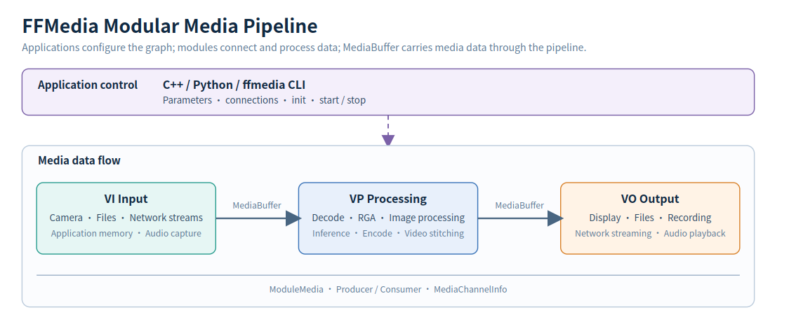

# FFMedia Architecture

## A Pipeline Is a Directed Graph

FFMedia represents a media application as a directed graph of modules. Modules process data, while the connections determine the direction of data flow.

A pipeline can be summarized as:

~~~text
VI input -> VP processing -> VO output
~~~

VI, VP, and VO describe module roles rather than mandatory stages. A pipeline can omit a stage, branch to multiple outputs, or merge multiple inputs:

~~~text
                         -> Display
Input -> Decode -> Image processing
                         -> Encode -> File/Network
~~~

## How Modules Connect

FFMedia media modules are based on `ModuleMedia`. Applications use a unified interface to set parameters, initialize modules, establish connections, start the pipeline, and stop it.

Modules are grouped by responsibility:

| Category | Role | Examples |
| --- | --- | --- |
| VI input | Produces video, audio, or application data | `cam`, `file-reader`, `rtsp-client`, `ffmpeg-demux` |
| VP processing | Decodes, encodes, transforms, stitches, or performs inference | `mpp-dec`, `mpp-enc`, `rga`, `video-stack`, `inference`, `image-processor` |
| VO output | Displays, saves, muxes, or streams data | `drm-display`, `file-writer`, `ffmpeg-mux`, `rtsp-server` |

Modules use a Producer/Consumer relationship:

- A Producer is the upstream module that produces data.
- A Consumer is the downstream module that receives data.
- `connectProducer()` establishes the connection and matches producer outputs to consumer inputs using channel information.

One Producer can connect to multiple Consumers, so the same data can be sent to display and recording at the same time. A Consumer can also declare multiple input channels for scenarios such as multi-channel stitching.

## How Channels and Buffers Flow

### MediaChannelInfo

A module may output multiple channels. For example, a network stream commonly contains both video and audio. `MediaChannelInfo` describes the channel ID, media type, codec, image or audio parameters, and extra data.

When modules connect, FFMedia uses this information to check compatibility. If no channel is specified, it normally selects a compatible channel automatically.

### MediaBuffer

`MediaBuffer` is the data container that flows through the pipeline. It carries the media payload, format, timestamp, channel, and status. Modules normally pass it through `std::shared_ptr<MediaBuffer>` without copying the payload.

When supported by the device and module, a video Buffer can share its underlying memory through DMA-BUF and reduce copies across hardware components.

## How the Pipeline Runs

The application configures the pipeline, while the modules process the data:

| Part | Main responsibilities |
| --- | --- |
| Application control | Create modules, set parameters, initialize, connect, start, and stop |
| Module runtime | Receive and send `MediaBuffer` objects from worker threads and use platform backends to process media |

Starting a normal input module with `start()` also starts its connected downstream modules. Stopping the input module then stops the downstream modules in order. If a connection or initialization fails, check the return value and parameters before starting the pipeline.
