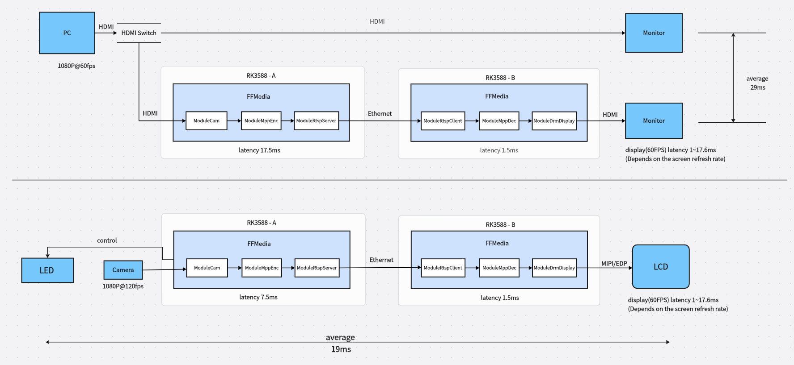

# FFMedia

[FFMedia](https://github.com/Firefly-rk-linux-utils/ffmedia_release) is a modular audio and video processing framework for Linux multimedia applications, with a focus on support for Rockchip platform capabilities such as V4L2, MPP, RGA, DRM/KMS, and EGL/GLES.

The framework abstracts capture, demultiplexing, encoding and decoding, image processing, inference, display, recording, and streaming from cameras, files, network streams, and application memory into composable modules. It is suitable for real-time media pipelines and embedded multimedia applications.

## Core Features

### Modular Pipelines

FFMedia encapsulates capabilities such as cameras, files, RTSP/RTMP, codecs, RGA image processing, GPU image processing, DRM display, streaming, and recording into unified modules. Modules are connected through a producer/consumer model, so users only need to focus on the data flow and a small number of parameter settings.

Common pipelines can be understood as follows:

```text
Input source VI -> Processing module VP -> Output module VO
```

For example:

```text
RTSP stream pulling -> MPP hardware decoding -> DRM low-latency display
Camera capture -> MPP hardware encoding -> RTSP/RTMP streaming
File reading -> Demuxing/decoding -> RGA/GPU scaling and rotation -> Display or re-encoding and saving
Multi-channel video -> Video Stack stitching -> Display or encoding and streaming
```

The project also provides C++ examples and Python bindings, making it convenient to quickly verify functions, integrate services, or perform secondary development.

### Hardware Acceleration

FFMedia is optimized for Rockchip platform hardware. Video encoding and decoding use MPP, while image scaling, cropping, format conversion, and composition use RGA or the GPU. Compared with pure CPU processing, a hardware-accelerated pipeline can significantly reduce CPU usage, making it more suitable for multi-channel video, long-term operation, and edge device deployment.

In typical applications, FFMedia can be used for:

- Multi-channel RTSP stream pulling, decoding, and display.
- Real-time encoding and streaming after camera capture.
- Video scaling, rotation, format conversion, and image composition.
- Multi-channel video stitching output.
- Video transcoding, container format conversion, and local recording.
- Connecting decoded video to RKNN inference for AI video analysis such as detection and tracking.

### Unified Parameter Interface and Extensibility

- Module configurations are described by the parameter system. The same parameter names, types, and hierarchy can be queried and configured from C++, Python, and the command line.
- Applications can directly compose existing modules or inherit from `ModuleMedia` to implement custom data sources, processors, or output modules.

### High Real-Time Performance

FFMedia's low-latency capability comes from hardware codecs, modular pipelines, buffer queue control, and display path optimization. According to the low-latency display tests in the project README:

- In an HDMI input forwarding display scenario, the average latency from HDMI input to forwarding display is about `29ms`.
- In a camera capture forwarding display scenario, the average latency from camera capture to forwarding display is about `19ms`.
- By adjusting display timing and the screen refresh rate, the display latency fluctuation range can be optimized from about `1ms~17.6ms` to about `1ms~7ms`.



These features make FFMedia suitable for latency-sensitive scenarios such as video surveillance, remote control, low-latency preview, industrial vision, edge AI video analysis, and multimedia forwarding.
