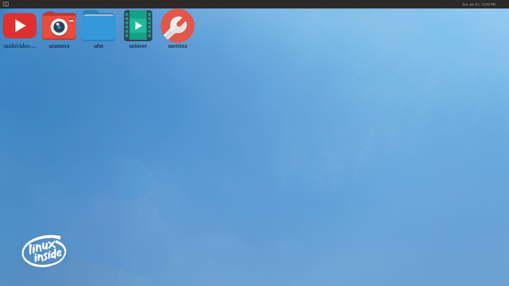
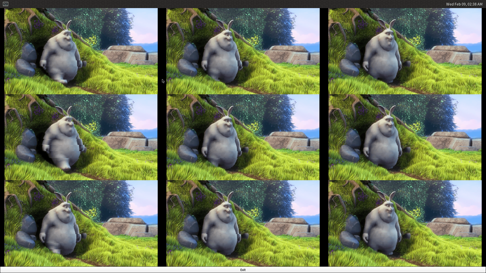
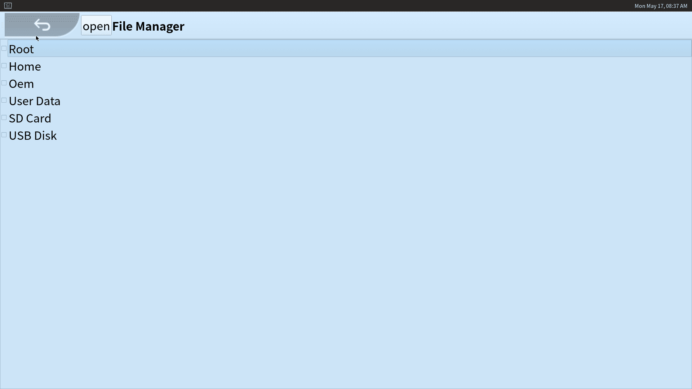
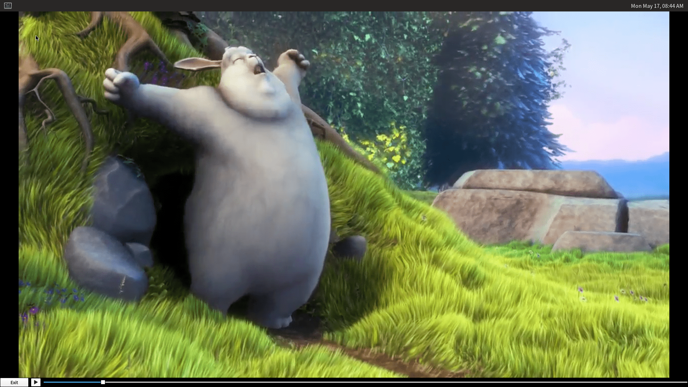
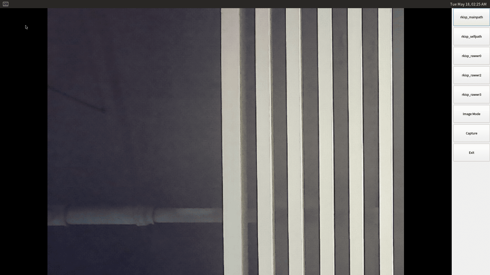
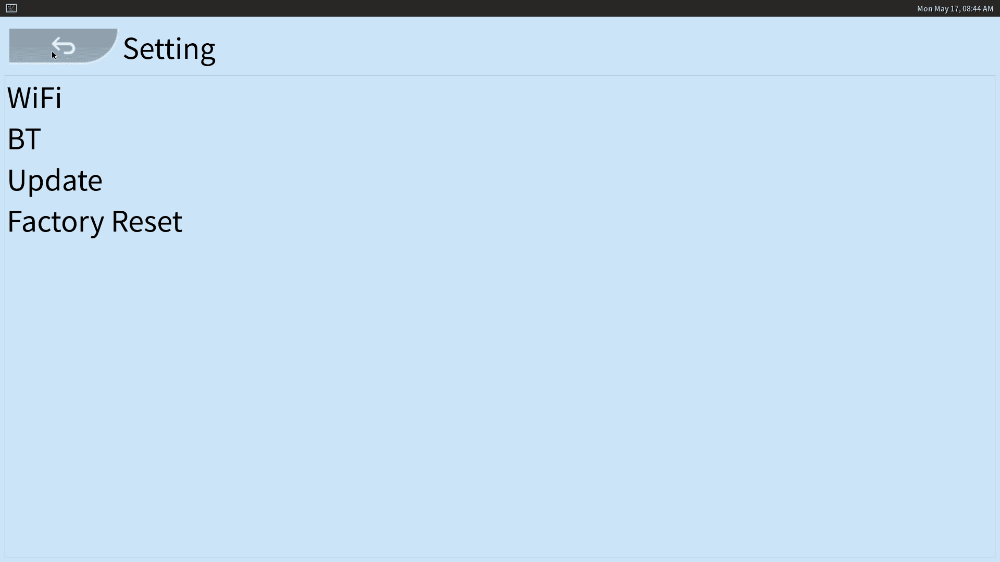

# Buildroot Desktop Applications

The officially released Buildroot firmware supports the Wayland desktop environment and some Qt applications by default, as shown below:

## multivideoplayer

The multivideoplayer is used to test the device's multi-channel video playback ability, display ability and hardware decoding ability.

## qfm

The qfm is a file browser.

## qplayer

The qplayer is a multi-function player, it can play videos, audios and display pictures.

## qcamera

The qcamera is a camera application, can take photos and record videos.

Launch the qcamera when device is connected to a camera, qcamera will automatically display the camera pictures. And the buttons on the right side are:

* Image Mode: Now is image mode, click to change to the video record mode.
* Capture: capture image, it will change to Record button when in video record mode.
* Exit: close the application.

## qsetting

The qsetting is a system setting tool, you can config WiFi connection, bluetooth connection and perform factory reset, firmware update in it.

