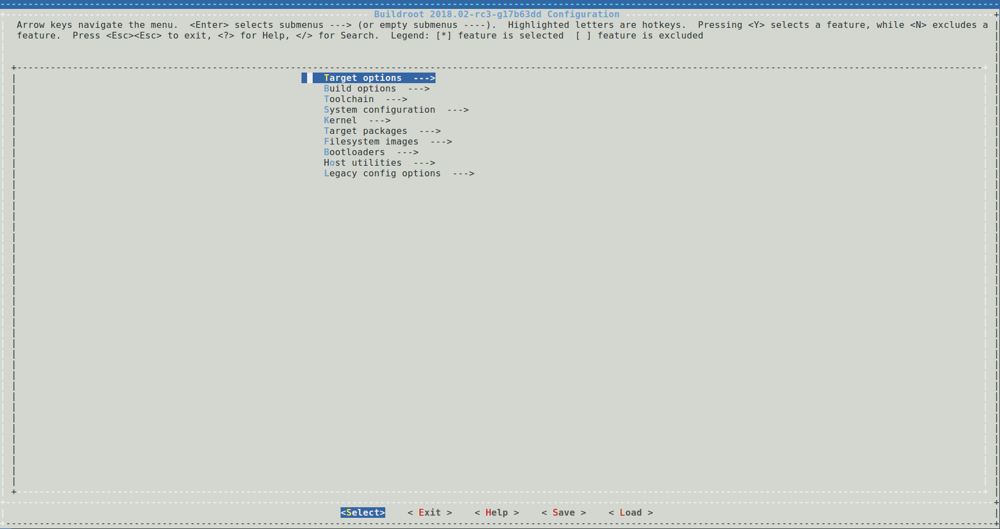
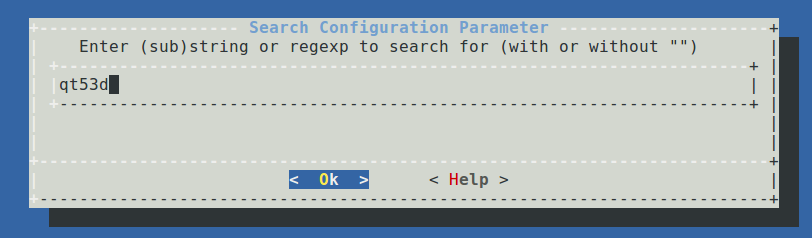
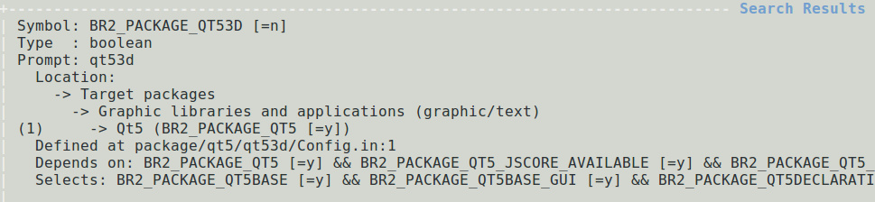
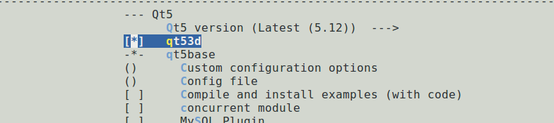
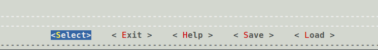
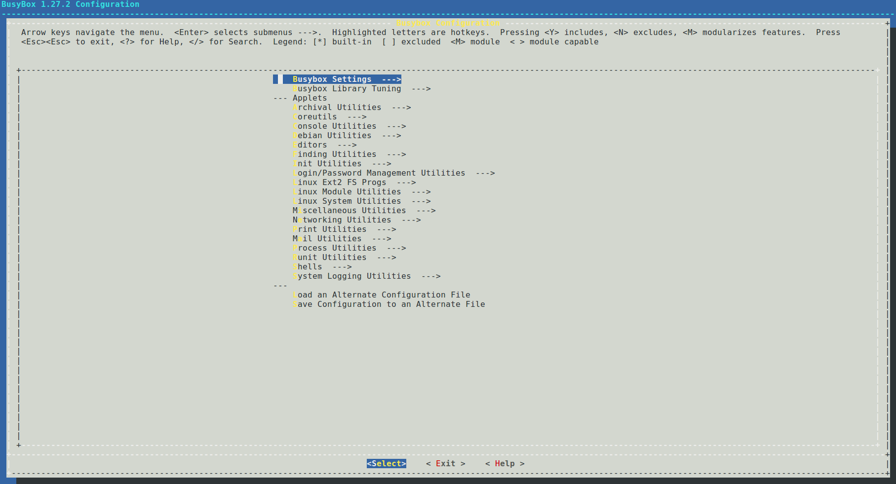
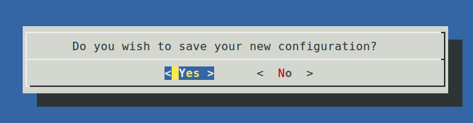

# Buildroot Configuration

Select the default profile:

```bash
# Enter the Firefly_Linux_SDK root directory
cd path/to/Firefly_Linux_SDK/
# Select configuration file
# `configs/rockchip_rk3568_defconfig`
source envsetup.sh rockchip_rk3568
```

After the execution is completed, a compilation output directory, `output/rockchip_rk3568` will be generated, and subsequent operations of `make` can be executed in this directory.

## Configure package

Open the configuration interface:

```bash
make menuconfig
```



We can add or cut some tools in the configuration interface to customize system functions as required. Take adding `qt53d` as an example:

Enter `/` to enter the search interface, enter the content you want to find `qt53d`, and press Enter to search:





Select `1` to jump to the corresponding page, press the space to select the configuration:



After the configuration is completed, move to `Save` and press Enter to save to `.config`; move to `Exit` and press Enter to exit.



Save the configuration file:

```bash
make savedefconfig
```

Save the changes to the configuration file `configs/rockchip_rk3568_defconfig`.

## Configure Busybox

Open the configuration interface and configure:

```bash
make busybox-menuconfig
```



After the configuration is complete, move to `Exit` and press Enter to exit, select `Yes` in the pop-up window and save it to `.config`.



Save the configuration file:

```bash
make busybox-update-config
```

Save the changes to the configuration file `board/rockchip/common/base/busybox.config`.
