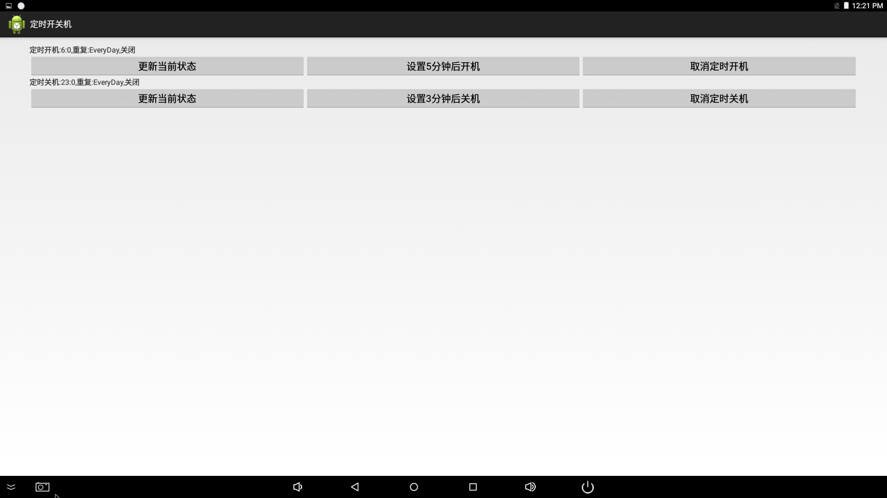

# FireflyApi

## 1. Overview
FireflyApi provides some system interfaces and encapsulates the functional interface that users need, so that users can use the system's common interfaces in an easy and simple way.
This document is a brief introduction of the interfaces. The specific use cases are described below.

* Support all series models of rk3288 Android5.1 platform
* Support all series models of rk3399 Android7.1 platform
* Support all series models of rk3128 Android5.1 platform

## 2. Resources download and use

When using FireflyApi, please check whether the firmware of device is the latest version. Find the corresponding model in the page of [[Resource Download]] (http://www.t-firefly.com/doc/download/page/id/4.html), and check if your firmware version is up-to-date. At the same time, you can also synchronize the SDK to the latest submission. The specific steps are as follows: first, select the corresponding [[wiki]] (http://wiki.t-firefly.com/), then find the synchronized method in the Android Development-> Build the Android Firmware.

A complete set of Demo used by FireflyApi:

* [[RK3288 firefly_sdkapi_demo.zip]](https://drive.google.com/drive/folders/15g4mIQDLdLuMBvk6s8ss44ATBM4WW3gN?usp=sharing)
* [[RK3399 firefly_sdkapi_demo.zip]](https://drive.google.com/drive/folders/1Bez_YpDJyupHw3BWiJnAteo4MtlQMRgq?usp=sharing)
* [[RK3128 firefly_sdkapi_demo.zip]](https://drive.google.com/drive/folders/1w9y4axhZEq8QoAQfptNDCuJ3XyIH7WBC?usp=sharing)

Demo mainly includes the source codes of firefly_sdkapi_demo.apk, firefly-api.jar,libfirefly_api.so and firefly_sdkapi_demo, etc. About apk and
the use of the library are as follows:
```
├── apk
│   └── firefly_sdkapi_demo.apk
├── lib
│   ├── armeabi-v7a
│   │   └── libfirefly_api.so
│   └── firefly-api.jar
├── Readme_CN.txt
├── Readme_EN.txt
└── src
    └── firefly_sdkapi_demo
```

### 2.1 Brief introduction of firefly_sdkapi_demo apk
firefly_sdkapi_demo apk is a Demo program based on the FireflyApi interface. Users can verify their own programs or related interfaces through the implementation of functions in the Demo.
When using the latest version of firmware, there is a built-in firefly_sdkapi_demo app as shown in the figure


* Click to enter the apk, there will be a corresponding interface implementation list, as shown below


* System settings interface implementation
 


* Time switch interface implementation



* Hardware interface implementation
 


### 2.2 How to use FireflyApi in eclipse
firefly_sdkapi_demo apk is to provide the user with corresponding functions of the interface, if the user needs to write his own application,
it is required to put firefly-api.jar in the libs directory, and libfirefly_api.so in the libs/armeabi-v7a directory.   
	

      　　　　　|-libfirefly_api.so
	

Adding method is as follows


## 3.FireflyApi interface description
### 3.1 System information
1. FireflyApiversion information  
	```
	Function：public String getFireflyApiVersion()  
	Description：FireflyApi version information   
	Example：   

2. Get the current device model
	```
	Function：public String getAndroidModel()   
	Description：Get the current device model  
	Example：   

3. Get the current device android system version
	```
	Function：public String getAndroidVersion()   
	Description：Get the current device android system version   
	Example：   

4. Get the RAM size of the device. The unit of measurement is MB
	```
	Function：public long getRamSpace()   
	Description：Get the RAM size of the device. The unit of measurement is MB   
	Return：Returns the RAM size in MB  
	Example：   

5. Get the RAM size of the device and format it as String
	```
	Function：public String getFormattedRamSpace()   
	Description：Get the RAM size of the device and format it as String   
	Return: The RAM size of the device, String format (1.5GB)  
	Example：   

6. Get the built-in Flash size of the device. The unit of measurement is MB
	```
	Function：public long getFlashSpace()   
	Description：Get the built-in Flash size of the device. The unit of measurement is MB   
	Return: Returns the Flash size in MB   
	Example：   

7. Get the built-in Flash size of the device，and format it as String
	```
	Function：public String getFormattedFlashSpace()   
	Description：Get the built-in Flash size of the device，and format it as String   
	Return: The Flash size of the device, String format (1.5GB)    
	Example：   

8. Get the firmware kernel version of the device
	```
	Function：public String getFormattedKernelVersion()   
	Description：Get the firmware kernel version of the device   
	Return: Kernel version   
	Example：   

9. Get the firmware system version and compile date of the device  
	```
	Function：public String getAndroidDisplay()   
	Description：Get the firmware system version and compile date of the device   
	Return: Firmware system version and compile date    
	Example：   

### 3.2 System settings
1. System shutdown
	```
	Function：public void shutDown(boolean showConfirm)   
	Description：System shutdown   
	Parameters：Does showConfirm display the shutdown box   
	Example：   

2. System restart
	```
	Function：public void reboot()  
	Description：System shutdown  
	Example：  

3. System hibernation
	```
	Function：public void sleep()  
	Description：System shutdown  
	Example：  

4. Screen capture
	```
	Function：public boolean  takeScreenshot(String path,String name)  
	Description：Take a screenshot and save it to the specified path  
	Parameters：path storage path  
	　　　name file stored name (available only in PNG format)  
	Return: Whether a screenshot is successfully captured true/false  
	Example：  

5. Screen rotation
	```
	Function：public boolean  setRotation(int rotation)  
	Description：Rotation   
	Screen parameters：rotation Screen direction:  Surface.ROTATION_0  

                               Surface.ROTATION_270　　
	Example：mFireflyApi.setRotation(Surface.ROTATION_0);
	```
6. Get the screen direction
	```
	Function：public int  getRotation()  
	Description：Get the screen direction  
	Return：rotation Screen direction:      Surface.ROTATION_0  

	Example：  

7. Cancel screen rotation
	```
	Function：public void  thawRotation()  
	Description：Cancel screen rotation  
	Example：  

8. Display / hide status bar 
	```
	Function：public void  setStatusBar(boolean show)  
	Description：Display / hide status bar  
	Parameters：show is set to true, it means to display the status bar, otherwise, false to hide the status bar  
	Example：  

9. Backlight switch
	```
	Function：public void  setLcdBackLight(boolean on)  
	Description：Turns the backlight off without hibernating the device, the software still runs  
	Parameters：on is set to true, it means to turn on the backlight, otherwise, false to turn it off  
	Example：  

10. Is there a backlight
	```
	Function：public boolean  hasLcdBackLight()  
	Description：Determine if there is backlight  
	Return：The value is set to true, it means there is backlight, or false for no backlight otherwise  
	Example：  

11. Set the screen brightness
	```
	Function：public boolean setBrightness(int brightness)  
	Description：Set the screen brightness  
	Parameters：brightness range 0-255  
	Return：true on success, false on failure 
	Example：  

12. Get screen brightness
	```
	Function：public int getBrightness()  
	Description：Get screen brightness  
	Return：screen brightness，returns -1 when the failure occurs  
	Example：  

13. Set system time
	```
	Function：public boolean setTime( int year, int month, int day, int hour,  
    	 int minute,int second)  
	Description：Set system time  
	Parameters：year       
	　　　month    
	　　　day      
	　　　hour     
	　　　minute   
	　　　second   
	Return：true on success, false on failure  
	Example：  

14. Silent installation
	```
	Function：public boolean silentInstall(String path)  
	Description：Silent installation 
	Parameters：path apk address  
	Return：true on successful installation  
	Example：  

15. Silent uninstallation
	```
	Function：public boolean silentUnInstall(String package_name)  
	Description：Silent uninstallation  
	Parameters：package name the application to be uninstalled  
	Return：Returns true if the app is uninstalled successfully, or false otherwise 
	Remark：Only supports apps installed manually, but not for built-in apps  
	Example：  

16. Execute shell command
	```
    Function：public Command execCmd(String cmd)  
	Description：Execute shell command  
	Parameters：cmd shell command  
	Return：Command　 input command
                   output　results  
                   exitStatus　shell running status, 0 is normal exit  
	Example：  

17. su permission to run shell command
	```
    Function：public static Command execSuCmd(String cmd)  
	Description：su permission to run shell command  
	Parameters：cmd shell command  
	Return：Command   input command
	  　　　　　　　　output results  
	  　　　　　　　　exitStatus　shell running status, 0 is normal exit  
	Example：  
	mFireflyApi.execSuCmd("cat init.rk30board.rc");//init.rk30board.rc Default permission 750
	```
18. Save system logcat
	```
	Function：public void saveLogcat(String folderPath,String fileName)
	Description：Grab the LOG message in the Android layer and save it to the corresponding directory 
	Parameters：folderPath save path 　　
    　　　fileName　　save file name
	Example：  

19. Get Hdmiin current connection status
	```
    Function：public　String getHdmiinStatus()
	Description：Get Hdmiin current connection status 
	Return：STATUS_HDMI_IN_CONNECT＝"1"　hdmiin connected 　　
    　　　STATUS_HDMI_IN_NO_CONNECT＝"0"　hdmiin not connected   　　
	Example：  

20. Get the current number of screens
	```
    Function：public　int getScreenNumber(Context context)
	Description：Get the current number of screens
	Return：Returns 0 if it fails  　　
	Example：  

### 3.3 Hardware interface
1. Enable watchdog
	```
	Function：public boolean watchDogEnable(boolean enable)  
	Description：Open/close watchdog  
	Parameters：enable is set to true, it means to open watchdog, otherwise, false to disenable 
	Return：true on success, false on failure  
	Remark：After opening the watchdog, you need to take care of feeding the watchdog once every 30s, otherwise, the watchdog will be closed.  
	Example：  

2. Feeding the dog
	```
    Function：public boolean watchDogFeed()
	Description：Feeding the dog once 
	Return：Returns true if it feeds the dog successfully  
	Example：  

3. Microphone switch（3128 board type is not supported）
	```
    Function：public boolean switchMic(int mic_type)  
	Description：Microphone is switched to onboard/headphone  
	Parameters：mic_type   TYPE_DEFAULT_MIC onboard mic   
                    TYPE_HEADSET_MIC headphone mic
	Return：Returns true if the switch is successful  
	Example：  

4. gpio control
	```
	Function：public boolean gpioCtrl(int gpio, String direction, int value)  
	Description：Control gpio  
	Parameters：gpio  
	　　　direction in, out, high, low high/low  
	　　　value 1/0  
	Return：true on success  
	Example：  
	boolean success = mFireflyApi.gpioCtrl(263,"out",1);//GPIO8_A7 gpio the node is 263
	```
5. Read the value of gpio
	```
    Function：public int gpioRead(int gpio)  
	Description：Read the value of gpio  
	Parameters：gpio  
	Return：Returns -1 when the read fails  
	Example：  
	int gpioValue = mFireflyApi.gpioRead(263);//GPIO8_A7 gpio the node is 263
	```
6. Check if the gpio port is occupied by the system
	```
	Function：public boolean isGpioOccupied(int gpio)  
	Description：Check if the gpio port is occupied by the system  
	Parameters：gpio  
	Return：Returns true if occupied  
	Example：  
	boolean occupied  = mFireflyApi.isGpioOccupied(263);//GPIO8_A7 gpio the node is 263
	```
7. Parse the node value of gpio
	```
	Function：public int gpioParse(String gpioStr)  
	Description：Parse the node value of gpio, for example GPIO8_A7 is converted to node 263  
	Parameters：gpioStr  
	Return：Returns -1 when the parse fails  
	Example：  
	int gpioValue= mFireflyApi.gpioParse("GPIO8_A7");//GPIO8_A7 gpio the node is 263
	```
8. Set USB power, choose to control OTG or USB interface
	```
	Function：public boolean setUsbPower(int type, boolean connect )  
	Description：Set USB power, choose to control OTG or USB interface  
	Parameters：type  TYPE_USBHOST //Control USB port  
	 　　　　　　TYPE_OTG     //Control OTG port  
     　　　　　　connect   
	Return：Returns to -1 if failed  
	Example：  
	mFireflyApi.setUsbPower("TYPE_USBHOST",ture);// connect USB HOST  
	mFireflyApi.setUsbPower("TYPE_USBHOST",false);// disconnect USB HOST  
	mFireflyApi.setUsbPower("TYPE_OTG",ture);// connect OTG  
	mFireflyApi.setUsbPower("TYPE_OTG",false);// disconnect OTG
	```
    ** Note：
    Due to different hardware design, the OTG interface of the device with 3128 board type cannot be powered off when connected to the host. **
    
    
9. The use of serial port  

* Import header file

*  Open the serial port according to the path and baud rate, and set the callback function  

*  Send a string to the serial port

*  Close the serial port

### 3.4 Installation upgrade 
1. Local ota package upgrade
	```
	Function：public void installPackage(String path) 
	Description：Restart the ota package upgrade. Currently, it only supports to put in the built-in storage root directory, i.e./sdcard/
	Parameters：Absolute path to the ota package
	Example：  

2. Reboot into recovery
	```
	Function：public void rebootRecovery() 
	Description：Reboot into recovery
	Example：  

### 3.5 Network 
The network feature needs to add the following permissions:


1. Get the MAC address of the device's Ethernet
	```
	Function：public  String getEthMacAddress() 
	Description：Get the MAC address of the device's Ethernet
    Return：Returns null if failed 
	Example：  

2. Get the IP address of the device's Ethernet
	```
	Function：public String getEthIpAddress() 
	Description：Get the IP address of the device's Ethernet
	Example：  

3. Get device's Ethernet information
	```
	Function：public EthernetInfo getEthInfo()
	Description：Get device's Ethernet information (including: ip, netmask, gateway, dns1, dns2)
	Example：  

4. Set the IP address of the device's Ethernet
	```
	Function：public boolean setEthIPAddress(boolean use_static_ip,String mIpaddr, String mMask, String mGw, String mDns1,String mDns2)
	Description：Set the IP address of the device's Ethernet
    Parameters：use_static_ip. When true is set to static ip, other parameters are valid, otherwise, when false is set to dynamic ip, it will automatically obtain ip address
    Return：Returns false if failed
	Example：  

5. Whether Ethernet is currently connected
	```
	Function：public boolean isEthConnect()
	Description：Whether Ethernet is currently connected
	Example：  

6. Set Ethernet on/off
	```
	Function：public boolean setEthernetEnabled(boolean enabled)
	Description：Set Ethernet on/off
    Parameters：enabled true(open)/false(close) 
	Example：  

7. Get the type of current network connection
	```
	Function：public String getCurNetworkType()
	Description：Get the type of current network connection
    Return：UNKNOWN/WIFI/ETHERNET/MOBILE
    Remark：Use BroadcatReceiver to monitor the Ethernet ConnectState changes through the monitoring of ETHERNET_STATE_CHANGED_ACTION = "android.net.ethernet.ETHERNET_STATE_CHANGED".
    　　　int connectState=intent.getIntExtra("ethernet_state", -1)
	Example：  

### 3.6 External storage related 
1. Get external storage path for USB-flash
	```
	Function：public String getUSBPath(int num)
	Description：Get external storage path for USB-flash
    Parameters：index of num u disk
    Return：Returns null if failed
	Example：  

2. Get the external SD card path
	```
	Function：public String getSDcardPath()
	Description：Get the external SD card path
    Return：Returns null if failed 
	Example：  

3. Uninstall external storage
	```
	Function：public　void doUnmountVolume(String path,boolean force,boolean removeEncryption)
	Description：Uninstall external storage
    Parameters：path is volume mountPoint, it will throw an exception
    　　　Force uninstall, when it is false, the occupied device will not be uninstalled
       　 When removeEncryption is true, it contains force that is true, which will force uninstall and remove the crypto map.

    Remark：When calling this interface to uninstall external storage, use StorageList.getVolumeState to detect the mount state of path, and then uninstall it when it is Environment.MEDIA_MOUNTED
	Example：

### 3.7 Timer switch　　
The timer switch has built-in a time switch apk in the system, and realizes the functions of different timers through interaction

Note: The rk3399 platform does not support the preset timer switch function.
#### 3.7.1 Preset timer switch function
1. Set power-on alarm
	```
	Function：public void setPowerOnAlarm(boolean enabled,long alarm_time)
	Description：Specify the UTC time, set the power-on alarm with no repetition
    Parameters：enabled    enable/disenable
         alarm_time startup time (UTC time)
	Example：  
	mFireflyApi.setPowerOnAlarm(true,System.currentTimeMillis()+60);
    //set to boot up after 1 minute
	```
2. Set the repeat timer to boot up
	```
	Function：setPowerOnAlarmRepeat( boolean enabled,int hour, int minutes,DaysOfWeek daysofweek)
	Description：Set a repeat cycle timer to boot up on a weekly basis
    Parameters：enabled    enable/disenable
         hour　 hour of boot time
         minutes　 minutes of boot time
         daysOfWeek　 Set a repeat cycle date to boot up on a weekly basis
         　　　　　　　SUNDAY -> MONDAY
	 	            0b1111111
	Example：  
	mFireflyApi.setPowerOnAlarmRepeat(true,10,30,0b1000011);
    // Set to boot up at 10:30 on Monday, Tuesday and Sunday
	```
3. Get the state of scheduled boot-up
	```
	Function：public Alarm getPowerOnAlarm()
	Description：Get the state of scheduled boot-up
	Example：  
	Alarm　powerOnAlarm =mFireflyApi.getPowerOnAlarm();
	```
4. Set a timed shutdown
	```
	Function：public void setPowerOffAlarm(boolean enabled,long alarm_time)
	Description：Specify the UTC time, set the power-off alarm with no repetition
    Parameters：enabled    enable/disenable
         alarm_time shutdown time (UTC time)
	Example：  
	mFireflyApi.setPowerOffAlarm(true,System.currentTimeMillis()+60);
    // set to boot up after 1 minute
	```
5. Set a repeat timer for automatic shutdown
	```
	Function：setPowerOffAlarmRepeat( boolean enabled,int hour, int minutes,DaysOfWeek daysofweek)
	Description：Set a repeat cycle timer to boot up on a weekly basis
    Parameters：enabled    enable/disenable
         hour　 hour of boot time
         minutes　 minutes of boot time
         daysOfWeek　 Set a repeat cycle date to boot up on a weekly basis
         　　　　　　　SUNDAY -> MONDAY
	 	            0b1111111
	Example：  
	mFireflyApi.setPowerOffAlarmRepeat(true,10,30,0b1000011);
    // Set to shut down device at 10:30 on Monday, Tuesday and Sunday
	```
6. Get the state of scheduled shutdown
	```
	Function：public Alarm getPowerOffAlarm()
	Description：Get the state of scheduled shutdown
	Example：  
	Alarm　powerOffAlarm =mFireflyApi.getPowerOffAlarm();
	```
    
If the above functions do not meet your needs, you can use the interface to achieve the desired functions through the programming. This interface is the most basic function to boot up/shut down device at a fixed time. It is turned on/off by the incoming id control. It needs to be manually set again after restart.

#### 3.7.2 Custom the interface to boot up/shut down device

1. Set a scheduled boot-up
	```
	Function：public void setSchedulePowerOn(int id,boolean enabled,long alarm_time)
	Description：Set a scheduled boot-up, id is defined by the user, which is used to turn on and off the scheduled boot-up. It needs to reset after restart
    Parameters：id    startup timer id
    	 enabled    enable/disenable　　
         alarm_time startup time (UTC time)
    Remark: Multiple scheduled boot-ups can be realized by multiple sets of startup timer id
	Example：  
	mFireflyApi.setSchedulePowerOn("12",true,System.currentTimeMillis()+60);
    // Set to start up device after 1 minute, id is 12
    mFireflyApi.setSchedulePowerOn("12",true,0);
    // Cancel the id that is "12"
	```
    
2. Set a scheduled shutdown
	```
	Function：public void setSchedulePowerOff(int id,boolean enabled,long alarm_time)
	Description：Set a scheduled shutdown, id is defined by the user, which is used to turn on and off the scheduled shutdown. It needs to reset after restart
    Parameters：id    shutdown timer id
    	 enabled    enable/disenable　　
         alarm_time shutdown time (UTC time)
    Remark: Multiple scheduled shutdowns can be realized by multiple sets of shutdown timer id
	Example：  
	mFireflyApi.setSchedulePowerOff("12",true,System.currentTimeMillis()+60);
    // Set to shut down device after 1 minute, id is 12
    mFireflyApi.setSchedulePowerOff("12",true,0);
    // Cancel the id that is "12"
	```