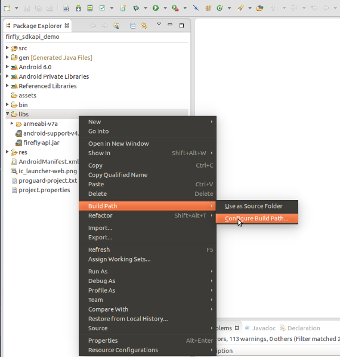
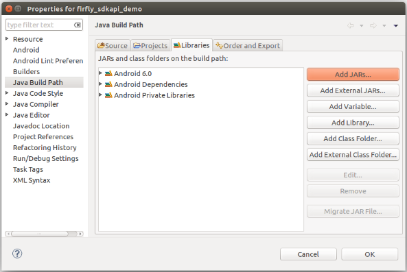
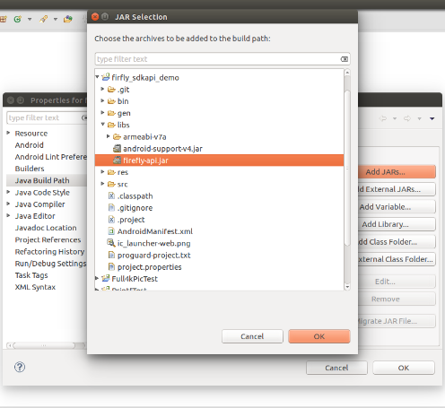

# FireflyApi overview

## 1.概述
FireflyApi提供了部分系统接口以及封装了部分用户需要的功能接口，主要是为了让用户容易和简单的使用系统常用接口，
此文档只是对接口进行简单的说明，具体的使用案例如下描述。

* 支持rk3288 Android5.1平台所有系列机型
* 支持rk3399 Android7.1平台所有系列机型
* 支持rk3128 Android5.1平台所有系列机型

## 2.资源下载和使用

使用FireflyApi时先检查一下机器的固件是否是最新版本，在[[资源下载]](http://www.t-firefly.com/doc/download/page/id/4.html)
页面找到对应的机型查看固件是否最新，同时也可以同步SDK到最新提交,具体先选择对应机型的[[wiki]](http://wiki.t-firefly.com/)然后在Android开发->编译Android固件里面找到同步的方式。

FireflyApi使用的整套Demo:
* [[RK3288 firefly_sdkapi_demo.zip]](https://pan.baidu.com/s/1PWDezNtzI1bCNPZPunaeHQ)（提取码：jvy6）  
* [[RK3399 firefly_sdkapi_demo.zip]](https://pan.baidu.com/s/1-VOKnlXFUquGOcBCvzVQlQ)（提取码：icud） 
* [[RK3128 firefly_sdkapi_demo.zip]](https://pan.baidu.com/s/13E9koEDBau1bSONVIB88Og )（提取码：e5wt）

Demo主要包含firefly_sdkapi_demo.apk,firefly-api.jar,libfirefly_api.so和firefly_sdkapi_demo的源码等，关于apk和
库的使用如下小结描述
```
├── apk
│   └── firefly_sdkapi_demo.apk
├── lib
│   ├── armeabi-v7a
│   │   └── libfirefly_api.so
│   └── firefly-api.jar
├── Readme_CN.txt
├── Readme_EN.txt
└── src
    └── firefly_sdkapi_demo
```

### 2.1 firefly_sdkapi_demo apk 简述
firefly_sdkapi_demo apk 是基于FireflyApi的接口实现的Demo程序，用户可通过Demo中功能的实现来验证自己的程序或相关接口。
当使用最新版本的固件时，里面会内置firefly_sdkapi_demo的应用如图


* 点击进入apk后会有相应的接口实现列表如图


* 系统设置接口实现
 


* 定时开关机接口实现


* 硬件接口实现
 


### 2.2 如何在eclipse中使用 FireflyApi
对于firefly_sdkapi_demo apk是给用户呈现出接口相应的功能，用户如需要编写自己的应用程序，
需要将firefly-api.jar放在libs目录下，libfirefly_api.so放到libs/armeabi-v7a目录下   
	
	|-libs  
     	|-firefly-api.jar  
     	|-armeabi-v7a  
      　　　　　|-libfirefly_api.so
	

添加方式如下








## 3.FireflyApi接口说明
