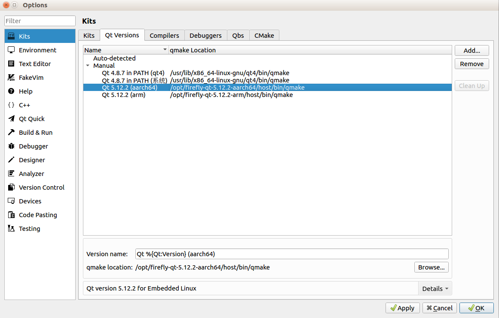
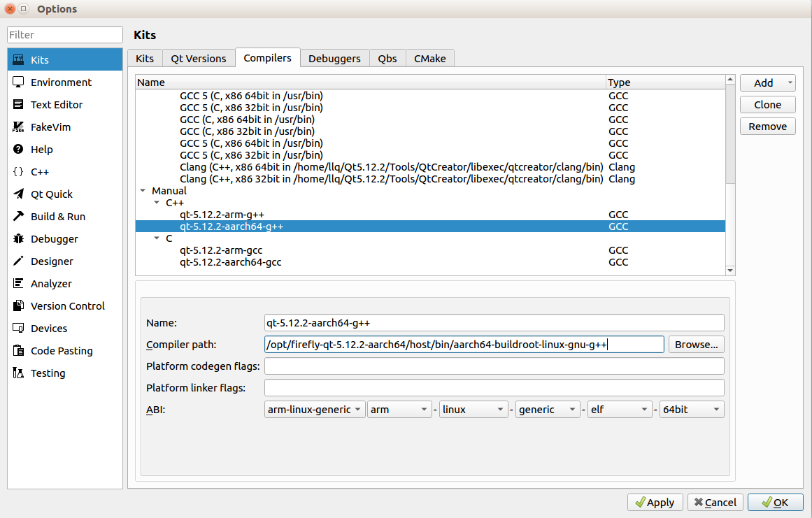
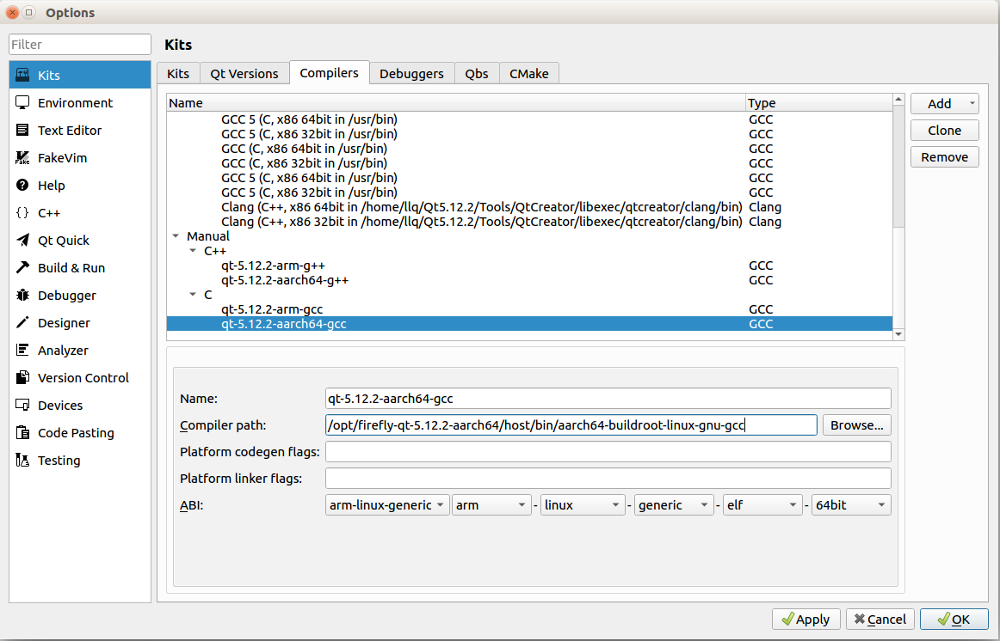
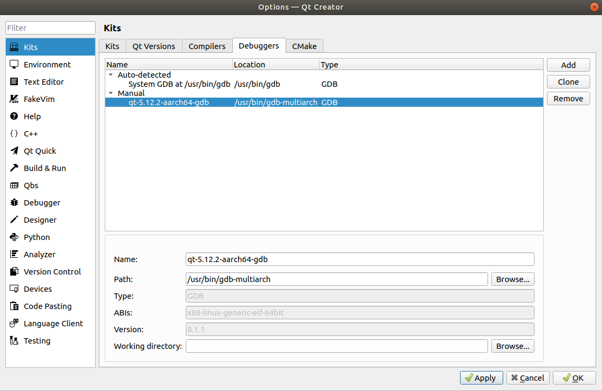
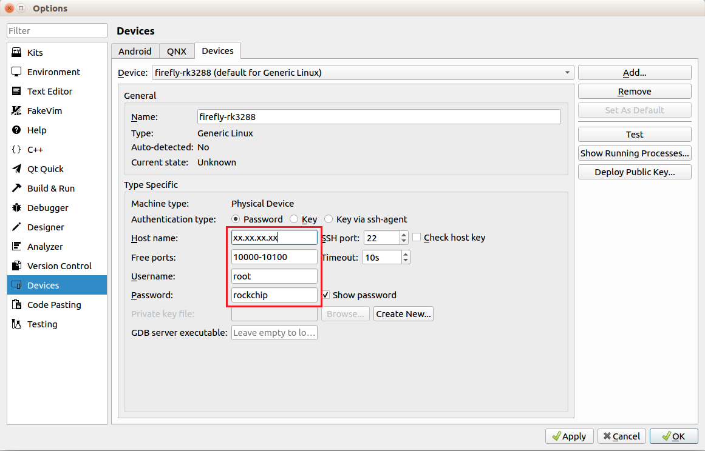
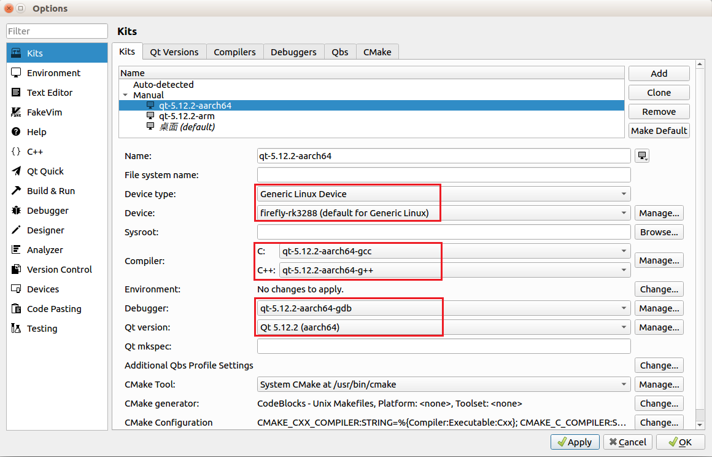
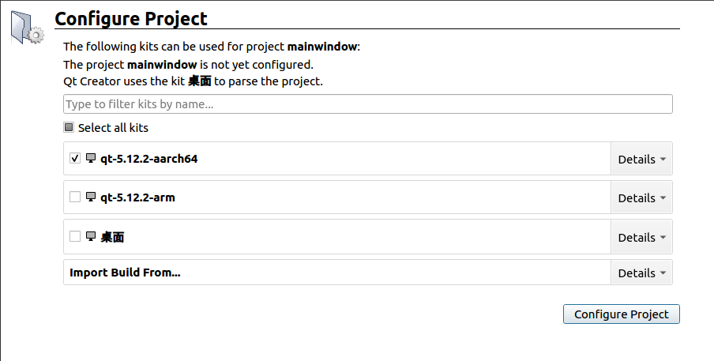
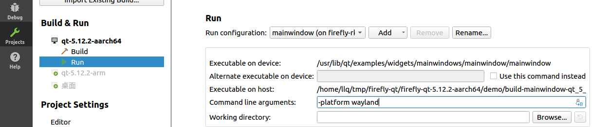
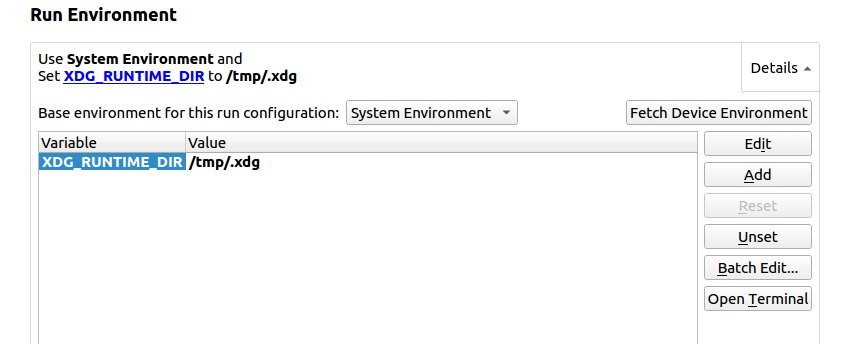
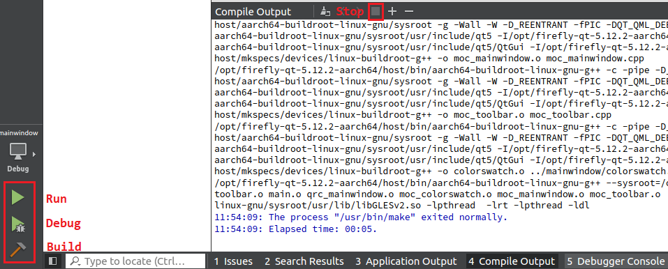

# Qt Creator

目标平台的系统是 Ubuntu 22.04 则不用看本章节，直接在设备上使用 qtcreator，无需特殊设置。

其他版本系统需要交叉编译 qt，请继续往下看：

下面介绍主机上 Qt Creator 的使用说明，**在操作前，请先安装、配置好 Qt 交叉编译环境和运行环境**。

## 安装

进入 [Qt 官方下载页面](https://download.qt.io/archive/qtcreator/)，选择一个版本下载 qt-creator-opensource-linux-x86_64-x.x.x.run，下载完成之后，在终端执行`./xxxx.run`运行安装，注意文件需要有执行权限。

## 配置

下面以 firefly-qt-5.12.2-aarch64 环境作为例子进行配置，目标平台是 Buildroot 系统：

**目标平台系统不同，配置也稍有不同，所以请仔细查看文字说明，图片仅供参考，不要照搬图片中的配置**

安装完成后，启动 Qt Creator，打开菜单 `Tools -> Options`，找到 Kits。

* 配置 Qt Versions

  点击右侧 `add` 按钮添加，选择 Qt 环境安装位置中的 qmake 即可

  qmake：`/opt/firefly-qt-5.12.2-aarch64/host/bin/qmake`

* 配置 Compilers

  点击右侧 `add` 按钮添加 gcc 和 g++ 交叉编译器的位置

  如果主机安装了 crossbuild-essential-arm64，则编译器就在 `/usr/bin/` 下

  如果使用了第三方的交叉编译器，找到安装位置并添加即可

  如果目标平台是 Buildroot，则需要使用 Buildroot Qt 环境包中的编译器

  g++：`/opt/firefly-qt-5.12.2-aarch64/host/bin/aarch64-buildroot-linux-gnu-g++`

  gcc：`/opt/firefly-qt-5.12.2-aarch64/host/bin/aarch64-buildroot-linux-gnu-gcc`

为方便调试，配置 Debuggers 和 Devices 用于在线调试：

* 配置 Debuggers

  首先主机中安装 gdb-multiarch：`apt install -y gdb-multiarch`

  检查目标机上是否存在 /usr/bin/gdbserver，没有的话需要安装：`apt install -y gdbserver` (Buildroot 自带，无需安装)

  回到主机的 Qt Creator，点击右侧 `add` 按钮添加 gdb

  选择主机中的 gdb-multiarch ：`/usr/bin/gdb-multiarch`

* 配置 Devices

  设置好设备的 IP、用户名 (root) 和密码 (firefly) 。为了方便调试，可以在设备上设置静态 IP。

  GDB server 设置为 `/usr/bin/gdbserver`

* 配置 Kits

  将前面设置的配置项添加到 Kits。

  **如果目标平台是 Ubuntu 系统，这一步也需要添加 sysroot 的路径**

## 编译运行

打开 demo 程序，`Welcome -> Open Project`，选择要使用的 Kits：

之后打开 `Projects -> Run`，配置命令行参数，这里设置为 `-platform wayland`：

目标平台是 Ubuntu 则使用 `-platform xcb` (Ubuntu 桌面环境)，或者根据需要选择 `linuxfb`、`eglfs`

配置环境变量，即 `export XDG_RUNTIME_DIR=/tmp/.xdg`：

RK356X Buildroot 则需要使用 `/var/run` 而不是 `/tmp/.xdg`

目标平台是 Ubuntu 则需要根据之前设置的 `platform` 添加不同的环境变量，详情在 Qt 环境包中的说明文件中

如果目标平台的运行环境(本文开头提到的)之前已经配置好并成功运行 demo，此时可以直接点击右侧`Fetch Device Environment` 获取目标的环境变量

编译运行：

点击 `Build` 交叉编译 Qt 程序；点击 `Run` 或 `Debug` 在设备上运行或调试程序。要重新运行程序时，记得手动点击 `Stop` 关闭已经运行的程序。

编译生成目录和 demo 目录在同一位置。
