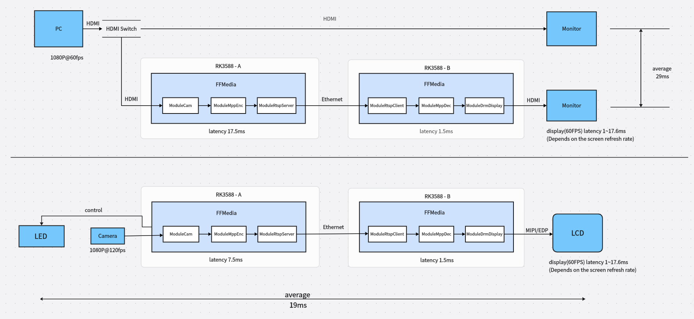
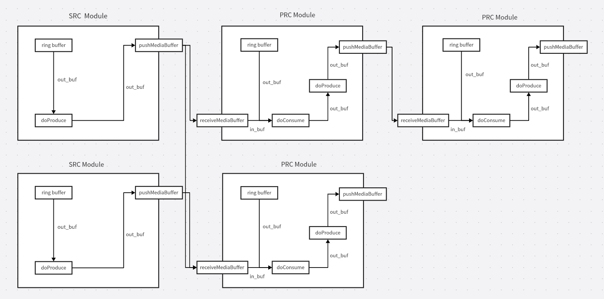

# FFMedia

[FFMedia](https://github.com/Firefly-rk-linux-utils/ffmedia_release) 是一套基于 Rockchip MPP/RGA 开发的音视频编解码与处理框架，面向摄像头采集、网络拉流、硬件编解码、图像处理、多路视频拼接、实时显示、转码推流、文件录制和 AI 推理等场景。

框架将复杂的音视频链路拆分为输入、处理、输出三类模块。开发者可以像搭积木一样组合模块，快速完成从采集、解码、缩放、编码到显示或推流的完整流程。FFMedia 充分利用 Rockchip 平台硬件能力，在降低 CPU 负载的同时，保持较高的实时性和较低的端到端延迟。


## 核心特点

### 简单易用

FFMedia 将摄像头、文件、RTSP/RTMP、编解码器、RGA 图像处理、DRM 显示、推流和录制等能力封装为统一模块。模块之间通过生产者/消费者模型连接，使用者只需要关注数据流向和少量参数配置。

常见链路可以直接按以下方式理解：

```text
输入源 VI -> 处理模块 VP -> 输出模块 VO
```

例如：

```text
RTSP 拉流 -> MPP 硬件解码 -> DRM 低延迟显示
Camera 采集 -> MPP 硬件编码 -> RTSP/RTMP 推流
文件读取 -> 解封装/解码 -> RGA 缩放旋转 -> 显示或重新编码保存
多路视频 -> Video Stack 拼接 -> 显示或编码推流
```

项目同时提供 C++ 示例和 Python 绑定，便于快速验证功能、接入业务或进行二次开发。

### 低负载

FFMedia 面向 Rockchip 平台硬件能力设计，视频编解码使用 MPP，图像缩放、裁剪、格式转换和合成使用 RGA。相比纯 CPU 处理，硬件加速链路可以显著降低 CPU 占用，更适合多路视频、长时间运行和边缘设备部署。

在典型业务中，FFMedia 可用于：

- 多路 RTSP 拉流、解码和显示。
- 摄像头采集后实时编码推流。
- 视频缩放、旋转、格式转换和画面合成。
- 多路视频拼接输出。
- 视频转码、封装转换和本地录制。
- 解码后接入 RKNN 推理，实现检测、跟踪等 AI 视频分析。

### 高实时性与低延迟

FFMedia 的低延迟能力来自硬件编解码、模块化管线、缓冲队列控制和显示链路优化。根据项目 README 中的低延迟显示测试：

- HDMI 输入转发显示场景中，从 HDMI 输入到转发显示的平均延迟约为 `29ms`。
- Camera 采集转发显示场景中，从 Camera 采集到转发显示的平均延迟约为 `19ms`。
- 通过调整显示时序和屏幕刷新率，可将显示延迟波动范围从约 `1ms~17.6ms` 优化到约 `1ms~7ms`。



这些特性使 FFMedia 适合视频监控、远程操控、低延迟预览、工业视觉、边缘 AI 视频分析和多媒体转发等对实时性敏感的场景。

## 架构概览

FFMedia 采用 Producer/Consumer 模型，所有单元都抽象为 `ModuleMedia` 类。一个生产者可以连接多个消费者，一个消费者也可以连接多个生产者。输入源模块没有上游生产者，处理和输出模块通过统一接口接入管线。




## 典型应用场景

### 低延迟视频预览

从摄像头或网络流获取视频后，使用 MPP 解码并通过 DRM 直接显示，适合本地预览、设备调试、远程画面回显等场景。

```text
Camera / RTSP -> MppDec -> DRM Display
```

### 实时转码推流

读取本地文件、摄像头或网络流，经过解码、缩放、旋转或重新编码后推送到 RTSP/RTMP 服务。

```text
File / Camera / RTSP -> MppDec -> RGA -> MppEnc -> RTSP / RTMP
```

### 多路视频处理

同时拉取多路 RTSP 视频流，进行解码、拼接、显示或重新编码推流。Video Stack 可用于多路视频拼接输出，硬件加速可以降低多路场景下的 CPU 压力。

```text
RTSP x N -> MppDec x N -> Video Stack -> DRM Display / MppEnc -> Network
```

### AI 视频分析

视频解码后接入 RKNN 推理模块，可实现目标检测、目标跟踪和多线程推理等业务。

```text
File / RTSP / Camera -> MppDec -> Inference -> OSD / Display / Encode
```

## 接入方式

FFMedia 的接入重点不是记忆大量命令，而是按业务目标选择模块并连接管线。开发者通常只需要完成三步：

1. 选择输入或聚合模块：摄像头、文件、内存数据、RTSP/RTMP 网络流、FFmpeg Demux 或 Video Stack 多路拼接模块。
2. 选择处理能力：硬件解码、硬件编码、RGA 图像处理、AAC 音频编解码或 RKNN 推理。
3. 选择输出目标：DRM/X11 显示、文件保存、RTSP/RTMP 推流、音频播放或 FFmpeg Mux。

### C++ 接入

C++ 接口适合对性能、稳定性和生命周期控制要求较高的业务。模块统一继承自 `ModuleMedia`，典型流程为创建模块、设置参数、初始化、建立上下游关系、启动运行、停止释放。

这种模式适合嵌入式产品、边缘网关、多路视频处理服务和长期运行的音视频后台进程。

### Python 接入

Python 绑定基于 pybind11，接口与 C++ 模块基本对应。它适合快速验证链路、调试算法、接入 AI 推理流程，或在已有 Python 业务中复用 FFMedia 的采集、编解码和显示能力。

### 部署环境

FFMedia 主要面向 Rockchip 平台，常用依赖包括编译工具链、CMake、libdrm、alsa、GLES、X11 和 JPEG 相关库。涉及 AI 推理时，需要对应 RKNN 运行库。

在实际产品中，建议将依赖库路径、芯片平台、显示设备、音频设备和网络协议参数固化到部署配置中，减少运行时环境差异带来的调试成本。

## 适合 FFMedia 的业务

FFMedia 适合部署在 Rockchip 平台上的实时音视频业务，尤其适合以下方向：

- 摄像头实时预览和录制。
- RTSP/RTMP 拉流、转发和推流。
- 多路视频解码、拼接、显示和转码。
- 低延迟 HDMI/Camera 采集转发显示。
- 视频格式转换、缩放、裁剪、旋转和合成。
- 边缘 AI 视频分析、目标检测和目标跟踪。
- 需要低 CPU 占用、长时间稳定运行的嵌入式音视频系统。
