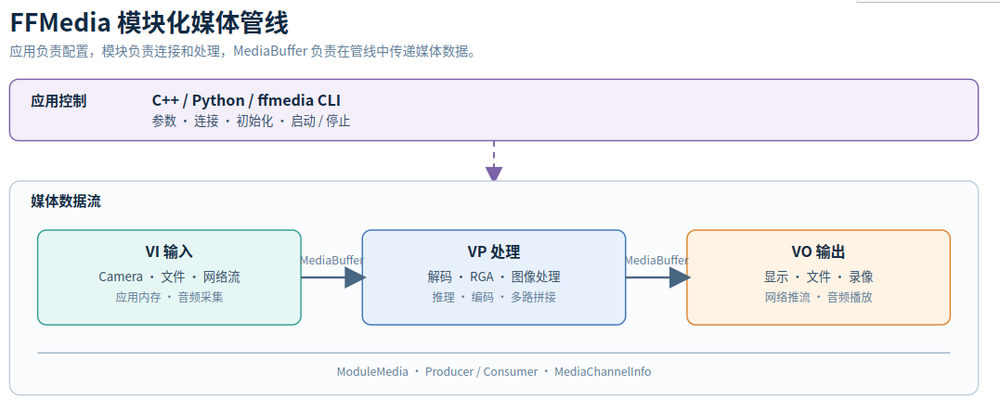

# FFMedia 架构

## 一条管线就是一张有向图

FFMedia 把媒体业务表示为由多个模块组成的有向图。模块负责处理数据，连接关系决定数据流向。

管线可以概括为：

~~~text
输入模块（VI） -> 处理模块（VP） -> 输出模块（VO）
~~~

VI、VP、VO 表示模块职责，不是必须经过的固定步骤。实际管线可以省略某个阶段，也可以分支或汇聚：

~~~text
                         -> 屏幕显示
输入 -> 解码 -> 图像处理
                         -> 编码 -> 文件/网络
~~~

## 模块如何连接

FFMedia 的媒体模块以 `ModuleMedia` 为基础。应用通过统一接口设置参数、初始化模块、建立连接、启动和停止管线。

模块按职责分为三类：

| 类别 | 作用 | 示例 |
| --- | --- | --- |
| VI 输入 | 产生视频、音频或应用数据 | `cam`、`file-reader`、`rtsp-client`、`ffmpeg-demux` |
| VP 处理 | 解码、编码、图像处理、拼接或推理 | `mpp-dec`、`mpp-enc`、`rga`、`video-stack`、`inference`、`image-processor` |
| VO 输出 | 显示、保存、封装或推流 | `drm-display`、`file-writer`、`ffmpeg-mux`、`rtsp-server` |

模块之间采用生产者（Producer）和消费者（Consumer）关系：

- 生产者（Producer）是产生数据的上游模块。
- 消费者（Consumer）是接收数据的下游模块。
- `connectProducer()` 建立上下游连接，并根据通道信息匹配输入和输出。

一个 Producer 可以连接多个 Consumer，因此同一份数据可以同时送往显示和录制。Consumer 也可以声明多个输入通道，用于多路拼接等场景。

## 通道和 Buffer 如何传递

### MediaChannelInfo

一个模块可能同时输出多路数据，例如网络流通常包含视频和音频。`MediaChannelInfo` 描述通道编号、媒体类型、编码格式、图像或音频参数以及附加数据。

连接时，框架根据这些信息判断上下游是否兼容；未明确指定通道时，通常自动选择兼容通道。

### MediaBuffer

真正流经管线的是 `MediaBuffer`。它携带媒体载荷、格式、时间戳、通道和状态等信息，模块之间通常通过 `std::shared_ptr<MediaBuffer>` 零拷贝传递。

在设备和模块支持时，视频 Buffer 可以通过 DMA-BUF 共享底层内存，减少数据跨设备复制。

## 管线如何运行

应用负责配置管线，模块负责处理数据：

| 部分 | 主要工作 |
| --- | --- |
| 应用控制 | 创建模块、设置参数、初始化、连接、启动和停止 |
| 模块运行 | 工作线程接收和发送 `MediaBuffer`，调用平台后端完成媒体处理 |

对普通输入模块调用 `start()` 后，框架会带动已连接的下游模块工作；停止输入模块则会依次停止后续模块。连接或初始化失败时，应先检查返回结果和参数，再启动管线。
