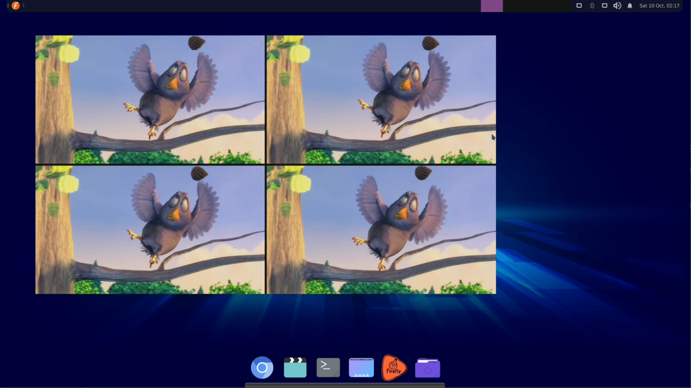

# FFMedia 通用使用方法

FFMedia 提供 C++ API、Python 绑定和 `ffmedia` 命令行三种使用方式。推荐的使用顺序是：

1. C++：用于正式应用和需要完整控制的媒体业务。
2. Python：用于快速开发、业务验证和脚本集成。
3. CLI：用于快速验证、调试，通用功能使用及脚本自动化等。

无论使用哪种方式，管线的基本流程都是：

~~~text
创建模块 -> 设置参数 -> 初始化输入模块 -> 连接下游模块
-> 初始化下游模块 -> 启动输入模块 -> 运行 -> 停止管线
~~~

连接前应先初始化生产者，让它发布输出通道；`connectProducer()` 会根据媒体类型、编码格式和图像或音频参数匹配上下游。连接或初始化失败时，应检查返回值，不要继续启动管线。

## C++ 接入

C++ 是 FFMedia 的主要应用接入方式，可以直接使用模块 API、参数系统、通道匹配和 `MediaBuffer`。正式应用通常在 C++ 中完成设备管理、业务循环、错误处理和自定义模块接入。

### 工程配置

推荐使用 SDK 导出的 CMake target：

~~~cmake
find_package(FFMedia REQUIRED CONFIG COMPONENTS core)
target_link_libraries(my_app PRIVATE FFMedia::FFMedia)
~~~

代码中使用稳定的聚合头：

~~~cpp
#include <ffmedia/ffmedia.hpp>
~~~

头文件、CMake 配置和动态库必须来自同一个 SDK 发布包，不能混用不同发布包中的文件。

### 创建一条基本管线

下面示例读取文件，使用 MPP 解码，再将解码后的数据写入文件。实际项目可以将输出模块替换为 `ModuleDrmDisplay`、`ModuleRendererVideo` 或网络输出模块。

~~~cpp
#include <cstdio>
#include <memory>

#include <ffmedia/ffmedia.hpp>

using namespace FFMedia;

int main()
{
    auto source = std::make_shared<ModuleFileReader>("input.mp4", false);
    int ret = source->init();
    if (ret < 0)
        return ret;

    auto decoder = std::make_shared<ModuleMppDec>();
    ret = decoder->connectProducer(source);
    if (ret < 0)
        return ret;
    ret = decoder->init();
    if (ret < 0)
        return ret;

    auto output = std::make_shared<ModuleFileWriter>("output.nv12");
    ret = output->connectProducer(decoder);
    if (ret < 0)
        return ret;
    ret = output->init();
    if (ret < 0)
        return ret;

    source->start();

    // 实际应用在这里运行自己的业务循环或等待 EOS。
    std::getchar();

    source->stop();
    return 0;
}
~~~

这条管线的连接关系是：

~~~text
ModuleFileReader -> ModuleMppDec -> ModuleFileWriter
~~~

调用源模块的 `start()` 会带动已连接的下游模块工作；调用源模块的 `stop()` 会停止整条管线。需要同时显示和保存时，可以将同一个解码器连接到多个输出模块。

### 设置参数

参数设置可直接通过模块接口直接设置，也可以通过模块参数统一由 `MediaParameter` 管理的参数路径设置配置，并在运行前检查返回值：

~~~cpp
auto encoder = std::make_shared<ModuleMppEnc>(MEDIA_CODEC_VIDEO_H264);

if (encoder->setParameter("encode/fps", 30) < 0)
    return -1;

if (encoder->setParameter("encode/bitrate", 4096) < 0)
    return -1;
~~~

参数名称、类型、默认值、取值范围和可写状态应以当前模块的 `queryParameter()` 或 `params` 查询结果为准。完整规则请参考[模块参数系统](https://github.com/Firefly-rk-linux-utils/ffmedia_release/blob/master/docs/ffmedia_parameters.md)。

## Python 接入

Python 绑定模块名为 `ff_pymedia`。它保留了模块、参数、通道连接和生命周期等主要能力，适合快速开发、自动化验证和脚本化集成；需要完整控制应用线程、设备资源或自定义模块时，优先使用 C++。

### 安装和导入

安装与当前 Python 解释器、系统架构匹配的 wheel，然后导入模块：

~~~bash
python3 -m pip install python/ff_pymedia-<与当前 Python 版本匹配的 wheel>.whl
~~~

~~~python
import ff_pymedia as ff
~~~

Python 版本、wheel 架构和动态库必须匹配。发布包中的 wheel 文件名以当前发布包实际内容为准。

### 创建 Python 管线

下面示例读取文件、使用 MPP 解码，并通过生产回调接收解码后的 Buffer：

~~~python
import ff_pymedia as ff


def on_frame(name, value, buffer):
    # 回调返回后仍需使用时，保留独立副本。
    frame = buffer.clone()
    if frame is not None:
        print(name, frame.getActiveSize())


source = ff.ModuleFileReader("input.mp4", False)
if source.init() < 0:
    raise RuntimeError("failed to initialize source")

decoder = ff.ModuleMppDec()
if decoder.connectProducer(source) < 0:
    raise RuntimeError("failed to connect decoder")
if decoder.init() < 0:
    raise RuntimeError("failed to initialize decoder")
if not decoder.setMediaBufferProduceHooker(on_frame):
    raise RuntimeError("failed to set output hook")

source.start()
try:
    input("Press Enter to stop...\n")
finally:
    source.stop()
~~~

Python 模块的构造函数、参数路径和回调签名以当前绑定导出内容为准。当前 `ff_pymedia` 未导出 `ModuleAppSource`、`ModuleAppProcessor` 和应用处理回调类型；应用注入数据时可使用已导出的 `ModuleMemReader` 或改用 C++ API。更多绑定差异请参考 [FFMedia API](https://github.com/Firefly-rk-linux-utils/ffmedia_release/blob/master/docs/ffmedia_api.md) 的 Python 说明。

## CLI 快速验证

`ffmedia` CLI 是通用管线验证工具，适合在编写应用前快速确认以下内容：

- 当前 SDK 是否提供所需模块。
- 参数路径、类型和取值是否正确。
- 两个模块的输出和输入通道是否能够匹配。
- 一条管线的连接关系是否符合预期。

### 查询模块和参数

~~~bash
./bin/ffmedia modules
./bin/ffmedia params mpp-dec
./bin/ffmedia params rga
./bin/ffmedia run --help
~~~

### 用 CLI 描述管线

CLI 使用三类参数：

| 参数 | 作用 | 示例 |
| --- | --- | --- |
| `-m ID=TYPE` | 声明模块实例 | `-m decoder=mpp-dec` |
| `-p ID:参数` | 设置模块参数 | `-p 'decoder:output{format=NV12}'` |
| `-c PRODUCER[@CHANNELS]=CONSUMER` | 连接模块 | `-c source@0=decoder` |

示例1：读取媒体文件，解码并显示到系统窗口上。

~~~bash
./bin/ffmedia run \
    -m source=ffmpeg-demux \
    -m decoder=mpp-dec \
    -m dis=renderer-video \
    -p 'source:source{uri=input.mp4;loop=0}' \
    -c source=decoder \
    -c decoder=dis \
    --sync dis=video
~~~

示例2：4路读取媒体文件、解码、2x2拼接到 1080p 画布上，并显示到系统的 720p 窗口上。

```bash
./bin/ffmedia run \
  -m src1=file-reader -m src2=file-reader -m src3=file-reader -m src4=file-reader \
  -m dec1=mpp-dec -m dec2=mpp-dec -m dec3=mpp-dec -m dec4=mpp-dec \
  -m stack=video-stack \
  -m vo=renderer-video \
  -p 'src1:source{path=/path/to/input1.mp4;loop=true}' \
  -p 'src2:source{path=/path/to/input2.mp4;loop=true}' \
  -p 'src3:source{path=/path/to/input3.mp4;loop=true}' \
  -p 'src4:source{path=/path/to/input4.mp4;loop=true}' \
  -p 'stack:output{width=1920;height=1080;format=NV12};frame-rate=30' \
  -p 'stack:input-layout{input-id=0;crop{x=0;y=0;width=956;height=536}}' \
  -p 'stack:input-layout{input-id=1;crop{x=964;y=0;width=956;height=536}}' \
  -p 'stack:input-layout{input-id=2;crop{x=0;y=544;width=956;height=536}}' \
  -p 'stack:input-layout{input-id=3;crop{x=964;y=544;width=956;height=536}}' \
  -p 'vo:window{x=100;y=100;width=1280;height=720}' \
  -c src1=dec1 \
  -c src2=dec2 \
  -c src3=dec3 \
  -c src4=dec4 \
  -c dec1=stack \
  -c dec2=stack \
  -c dec3=stack \
  -c dec4=stack \
  -c stack=vo

```



CLI 的完整语法和选项请参考上游仓库的 [`ffmedia` 命令行使用介绍](https://github.com/Firefly-rk-linux-utils/ffmedia_release/blob/master/examples/demo/ffmedia.md)。

## 常见问题

| 现象 | 优先检查 |
| --- | --- |
| 找不到动态库 | `LD_LIBRARY_PATH` 是否包含 SDK 的 `lib/aarch64-linux-gnu` 或 `lib` 目录 |
| 找不到模块 | `modules` 是否列出该模块，相关可选组件是否启用 |
| 参数设置失败 | 参数路径、类型、范围和当前状态是否符合 `params` 输出 |
| 连接失败 | 通道 ID、媒体类型和消费者输入要求是否匹配 |
| DRM 或 Camera 初始化失败 | 设备权限、设备格式、connector 和 plane 是否正确 |
| Python 无法导入 | Python 版本、wheel 架构和动态库路径是否匹配 |
