# Buildroot 使用指南

## 桌面应用

官方发布的 Buildroot 固件，默认支持 Wayland 桌面环境和一些 Qt 应用，如下图：

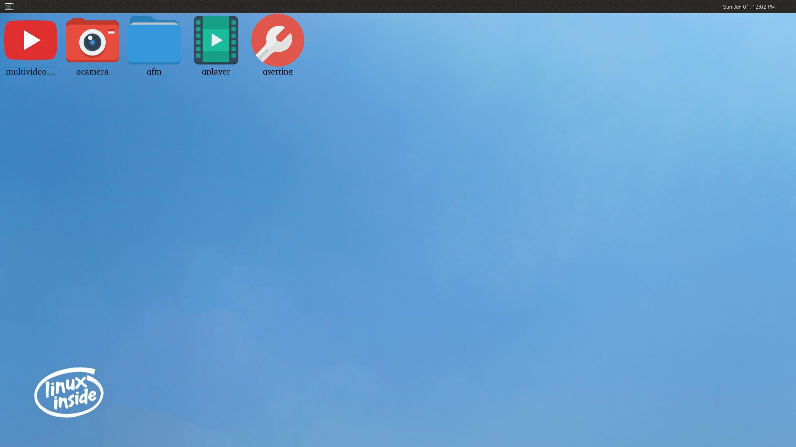

### multivideoplayer

多路视频播放器用于测试设备的多路视频播放能力、显示能力以及硬件解码能力。

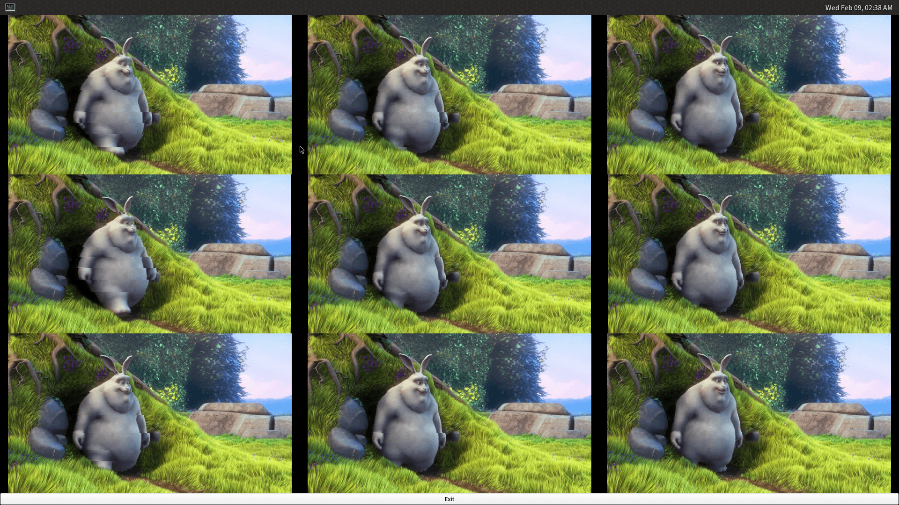

### qfm

qfm 是一个文件浏览应用

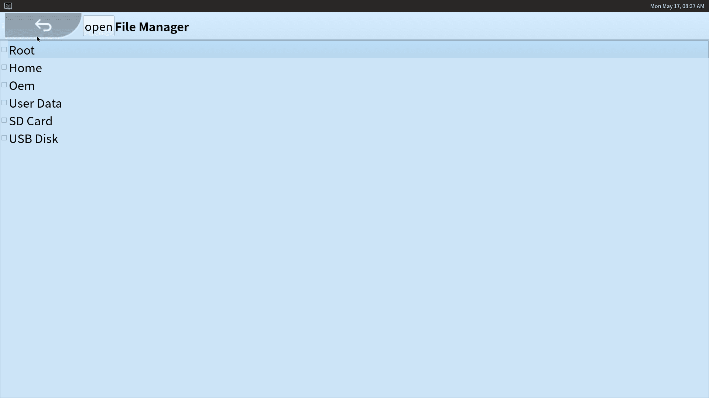


### qplayer

qplayer 是一个多功能播放器，可以播放视频、音频和浏览图片。

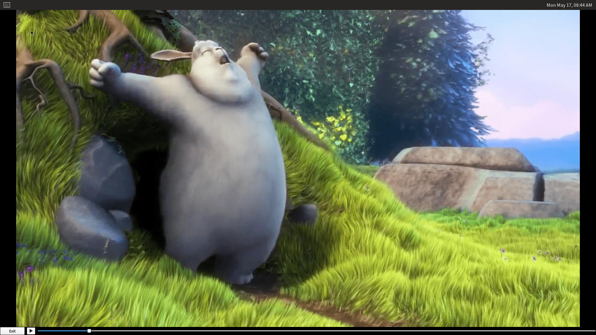

### qcamera

qcamera 是一款相机应用，可以进行拍摄和录像。


设备连接摄像头的情况下启动 qcamera 将自动显示摄像头画面，右侧按钮：

* Image Mode: 照相模式，点击可切换为 Video Mode 视频录制模式。
* Capture: 捕捉图像，在 Video Mode 下会变为 Record 录制按钮。
* Exit: 退出。

### qsetting

qsetting 是系统设置工具，可以设置 WiFi ，蓝牙，恢复出厂以及固件升级。

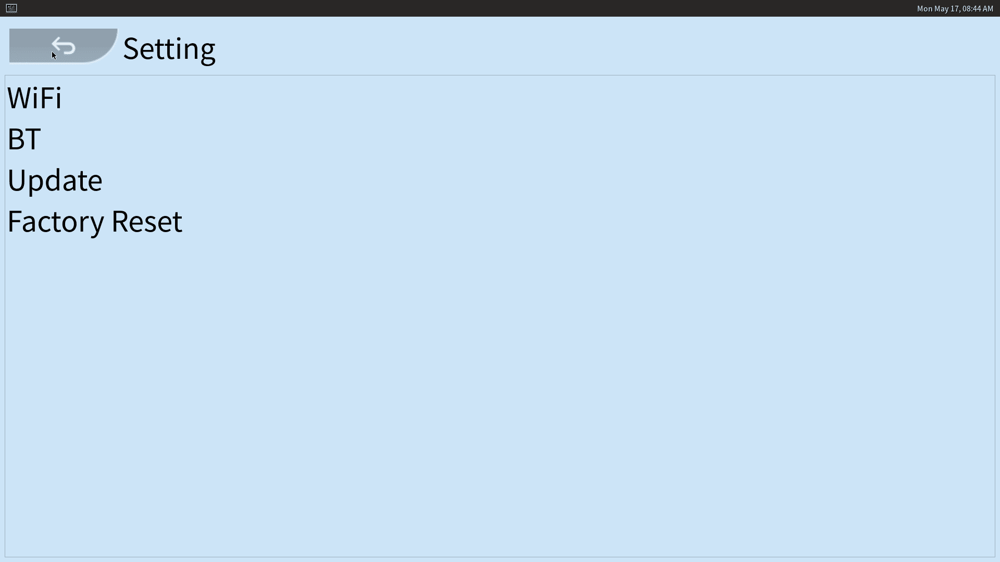


## 用户和密码

* 用户：root
* 密码：firefly


## 以太网配置

Buildroot的网络配置需要使用到 `/etc/network/interfaces` 配置文件，配置完成之后，运行`/etc/init.d/S40network restart`即可重启网络。手动调试可以直接使用 `ifdown -a` 和 `ifup -a`来重启网络。

### 常用配置

配置文件举例：如下配置文件将eth0网卡设置为动态IP地址，将eth1设置为静态IP地址

注意：`/etc/network/interfaces`的文件格式要求比较严格，如果遇到`Error: either "local" is duplicate, or "/24" is a garbage.`，那么很有可能是配置文件中多了一个空格

```
auto lo
iface lo inet loopback

auto eth0
iface eth0 inet dhcp

auto eth1
iface eth1 inet static
address 168.168.110.137
netmask 255.255.0.0
broadcast 168.168.1.255
gateway  168.168.0.1
```

（1）inet static：定义静态IP地址。支持的选项有：

```
address address
        Address (dotted quad/netmask) required

netmask mask
        Netmask (dotted quad or number of bits) deprecated

broadcast broadcast_address
        Broadcast address (dotted quad, + or -) deprecated. Default value: "+"

metric metric
        Routing metric for default gateway (integer)

gateway address
        Default gateway (dotted quad)

pointopoint address
        Address of other end point (dotted quad). Note the spelling of "point-to".

hwaddress address
        Link local address or "random".

mtu size
        MTU size

scope  Address validity scope. Possible values: global, link, host
```

（2）inet dhcp：通过DHCP协议获取IP地址。支持的选项有：

```
hostname hostname
        Hostname to be requested (pump, dhcpcd, udhcpc)

metric metric
        Metric for added routes (dhclient)

leasehours leasehours
        Preferred lease time in hours (pump)

leasetime leasetime
        Preferred lease time in seconds (dhcpcd)

vendor vendor
        Vendor class identifier (dhcpcd)

client client
        Client identifier (dhcpcd)

hwaddress address
        Hardware address.
```

（3）inet manual：没有为接口定义IP地址。通常由作为桥接或聚合成员的接口，需要以混杂模式运行的接口（ *例如，端口镜像或网络TAP* ）或在其上配置了VLAN设备的接口使用。这是保持接口不带IP地址的一种方法。支持的选项有：

```
hwaddress address
        Link local address or "random".

mtu size
        MTU size
```

### 高级设置

`/etc/network/interfaces`支持设置在网卡关闭/启动时，运行Linux命令行指令。由于`/etc/network/interfaces`支持的功能相对有限，这在配置静态路由、默认路由等网络配置时将会非常有帮助。

支持的可选选项有：pre-up、up、post-up、pre-down、down、post-down，在这些选项之后，加上命令行即可。

```
pre-up	网卡启用前的动作
up	启用时候的动作
post-up	启用后的动作
pre-down	关闭前的动作
down	关闭时动作
post-down	关闭后动作
说明：$IFACE自适应对于相应的网卡节点
```

配置举例：给eth1网卡配置一条静态路由

```
auto eth1
iface eth1 inet static
address 192.168.3.1
netmask 255.255.255.0
broadcast 192.168.3.255
post-up ip route add 192.168.4.0/24 via 192.168.3.2 dev $IFACE
```

配置举例：创建一个网桥，将eth0，eth1绑定到网桥，将其作为LAN口

```
auto lo
iface lo inet loopback

auto eth0
iface eth0 inet manual
pre-up ifconfig $IFACE up
post-down ifconfig $IFACE down

auto eth1
iface eth1 inet manual
pre-up ifconfig $IFACE up
post-down ifconfig $IFACE down

auto br0
iface br0 inet static
address 192.168.2.1
netmask 255.255.255.0
broadcast 192.168.2.255
pre-up brctl addbr $IFACE
pre-up brctl addif $IFACE eth0
pre-up brctl addif $IFACE eth1
bridge_ports eth0 eth1
post-down brctl delif $IFACE eth0
post-down brctl delif $IFACE eth1
post-down ifconfig $IFACE down
post-down brctl delbr $IFACE
```


## WiFi 连接

### 修改配置文件的方式

#### 方式1

通过 qsetting QT应用进行配置。

#### 方式2

修改如下文件：

```bash
vi /data/cfg/wpa_supplicant.conf
ctrl_interface=/var/run/wpa_supplicant
ap_scan=1
```

添加如下配置项

```bash
network={
ssid="WiFi-AP"		// WiFi 名字
psk="12345678"		// WiFi 密码
key_mgmt=WPA-PSK	// 加密方式
# key_mgmt=NONE		// 不加密
}
```

启动wpa_supplicant进程

```bash
wpa_supplicant -B -i wlan0 -c /data/cfg/wpa_supplicant.conf
```

### 临时修改的方式

修改如下文件：

```bash
vi /data/cfg/wpa_supplicant.conf
ctrl_interface=/var/run/wpa_supplicant
ap_scan=1
```

启动wpa_supplicant进程：

```bash
wpa_supplicant -B -i wlan0 -c /data/cfg/wpa_supplicant.conf
```

#### 通过wpa_cli配置WiFi

常用命令：

```bash
wpa_cli -i wlan0 scan             // 搜索附近wifi网络
wpa_cli -i wlan0 scan_result      // 打印搜索wifi网络
wpa_cli -i wlan0 add_network      // 添加一个网络连接
```

如果要连接加密方式是[WPA-PSK-CCMP+TKIP][WPA2-PSK-CCMP+TKIP][ESS] (wpa加密)，wifi名称是name，wifi密码是：psk。操作如下：

```bash
wpa_cli -i wlan0 set_network 0 ssid '"name"'
wpa_cli -i wlan0 set_network 0 psk '"psk"'
wpa_cli -i wlan0 set_network 0 key_mgmt WPA-PSK
wpa_cli -i wlan0 enable_network 0    //使能WiFi
```

如果要连接加密方式是[WEP][ESS] (wep加密)，wifi名称是name，wifi密码是psk。操作如下：

```bash
wpa_cli -i wlan0 set_network 0 ssid '"name"'
wpa_cli -i wlan0 set_network 0 key_mgmt NONE
wpa_cli -i wlan0 set_network 0 wep_key0 '"psk"'
wpa_cli -i wlan0 enable_network 0
```

如果要连接加密方式是[ESS] (无加密)，wifi名称是name。操作如下：

```bash
wpa_cli -i wlan0 set_network 0 ssid '"name"'
wpa_cli -i wlan0 set_network 0 key_mgmt NONE
wpa_cli -i wlan0 enable_network 0
```

使能保存WIFI连接信息

```bash
wpa_cli -i wlan0 set update_config 1
```

保存WIFI连接信息

```bash
wpa_cli -i wlan0 save_config
```

连接已有的连接

```bash
wpa_cli -i wlan0 list_network        // 列举所有保存的连接
wpa_cli -i wlan0 select_network 0     // 连接第1个保存的连接
wpa_cli -i wlan0 enable_network 0      // 使能第1个保存的连接
```

关闭WiFi

```bash
ifconfig wlan0 down
```


## 音/视频播放

```bash
# 播放 wav
aplay test.wav
gstwavplay.sh test.wav

# 播放 mp3
mp3play.sh test.mp3
gstmp3play.sh test.mp3

# 播放 mp4
gstmp4play.sh test.mp4
gstvideoplay.sh test.mp4
```


## SSH

官方发布的 SDK 默认已开启 ssh，用户为"root"，密码为"firefly"。如果不需要修改用户登录密码，可以跳过此章节。

### 修改方法

- 使能SSH相关选项

  - openssh

  ```
  BR2_PACKAGE_OPENSSH=y
  ```

  - 配置登录的账户root和密码

  ```
  BR2_TARGET_ENABLE_ROOT_LOGIN=y
  BR2_TARGET_GENERIC_ROOT_PASSWD="firefly"
  ```

- 修改配置文件

  - 修改板卡里`/etc/ssh/sshd_config`文件

  ```
  PermitRootLogin yes
  ```


## 外部存储设备

Buildroot 支持自动挂载外部存储设备：

- U 盘挂载路径：`/udisk`
- TF 卡挂载路径：`/sdcard`


## 恢复出厂设置

**注意：此出厂设置表示恢复为设备最后一次升级固件之后的初始状态。**

### 方法1

通过 qsetting QT 应用进行配置，点击 "Factory Reset" 功能选项进行操作。

### 方法2

通过 update 命令

```bash
update
# 或者
update factory / update reset
```


## 固件本地升级

Buildroot 支持从外部存储设备升级固件，以下是升级流程说明。关于如何编译 Buildroot 固件请用户参考相应板卡维基的**编译 Buildroot 固件**页面。

### 制作升级固件

按照正常的固件编译流程，制作用于升级的固件。

升级固件不一定要全分区升级，可修改 `package-file` 文件，将不要升级的分区注释掉，或者改为`RESERVED`

（1）修改文件 `tools/linux/Linux_Pack_Firmware/rockdev/package-file`

例如，将 `rootfs` 的相对路径改为 `RESERVED`，这样就不会打包根文件系统，即不升级根文件系统分区。

```bash
# name          relative path
#
#hwdef          hwdef
package-file    package-file
bootloader      image/miniloaderall.bin
parameter       image/parameter.txt
trust           image/trust.img
uboot           image/uboot.img
misc            image/misc.img
boot            image/boot.img
recovery        image/recovery.img
rootfs          RESERVED
oem             image/oem.img
userdata:grow   image/userdata.img
backup          RESERVED
```

（2）编译固件

```bash
./build.sh updateimg
```

将制作好的升级固件拷贝到 U 盘、TF 卡或者设备的 `/userdata/` 目录下，重命名为 `update.img`。

**注意：** 若将升级固件放至设备的 `/userdata/` 目录，则不要打包 `userdata.img`，将 `image/userdata.img` 改为 `RESERVED`。

### 升级过程

#### 方法1

通过 qsetting QT应用进行配置。点击 "Update" 功能选项进行操作。

#### 方法2

通过 update 命令。

```bash
# U 盘
update ota /udisk/update.img
# TF 卡
update ota /sdcard/update.img
# /userdata/
update ota /userdata/update.img
```

等待升级完成，升级成功后，设备会重新启动进入系统。


## Weston 配置

我们可以通过配置 Weston 对显示进行一些自定义设置，下文对部分设置进行说明。

### 状态栏设置

Weston 支持在 weston.ini 配置文件的 shell 段设置状态栏的背景色、位置，以及在 launcher 段设置快捷启动程序，如：

```ini
# /etc/xdg/weston/weston.ini

[shell]
# 颜色格式为 ARGB8888
panel-color=0xff002244
# top|bottom|left|right|none
panel-position=bottom

[launcher]
icon=/usr/share/weston/terminal.png
path=/usr/bin/weston-terminal

[launcher]
# 图标路径
icon=/usr/share/weston/icon_flower.png
# 快捷启动命令
path=/usr/bin/qsetting
```

### 背景设置

Weston 支持在 weston.ini 配置文件的 shell 段设置背景图案、颜色，如：

```ini
# /etc/xdg/weston/weston.ini

[shell]
# 背景图案(壁纸)绝对路径
background-image=/usr/share/weston/background.png
# scale|scale-crop|tile
background-type=scale
# 颜色格式为 ARGB8888，未设置背景图案时生效
background-color=0xff002244
```

### 待机及锁屏配置

Weston 的超时待机时长可以在启动参数中配置，也可以在 weston.ini 的 core 段配置，如：

```bash
# /etc/init.d/S50launcher
    start)
        ...
        # 0 为禁止待机，单位为秒
        weston --tty=2 -B=drm-backend.so --idle-time=0&
```

或者：

```ini
# /etc/xdg/weston/weston.ini

[core]
# 设置 5 秒未操作后进入待机状态
idle-time=5
```

### 显示颜色格式配置

Buildroot SDK 内 Weston 目前默认显示格式为 ARGB8888，对于某些低性能平台，可以在 weston.ini 的 core 段配置为 RGB565，如：

```ini
# /etc/xdg/weston/weston.ini

[core]
# xrgb8888|rgb565|xrgb2101010
gbm-format=rgb565
```

也可以在 weston.ini 的 output 段单独配置每个屏幕的显示格式，如：

```ini
# /etc/xdg/weston/weston.ini

[output]
# output 的 name 可以查看 /sys/class/drm/card0-name
name=LVDS-1
# xrgb8888|rgb565|xrgb2101010
gbm-format=rgb565
```

### 屏幕方向设置

Weston 的屏幕显示方向可以在 weston.ini 的 output 段配置，如：

```ini
# /etc/xdg/weston/weston.ini

[output]
name=LVDS-1
# normal|90|180|270|flipped|flipped-90|flipped-180|flipped-270
transform=180
```

如果需要动态配置屏幕方向，可以通过动态配置文件，如：

```bash
echo "output:all:rotate90" > /tmp/.weston_drm.conf # 所有屏幕旋转 90 度
echo "output:eDP-1:rotate180" > /tmp/.weston_drm.conf # eDP-1 旋转 180 度
```

### 分辨率及缩放配置

Weston 的屏幕分辨率及缩放可以在 weston.ini 的 output 段配置，如：

```ini
# /etc/xdg/weston/weston.ini

[output]
name=HDMI-A-1
# 需为屏幕支持的有效分辨率
mode=1920x1080
# 需为整数倍数
scale=2
```

如果需要动态配置分辨率及缩放，可以通过动态配置文件，如：

```bash
echo "output:HDMI-A-1:mode=800x600" > /tmp/.weston_drm.conf # 修改 HDMI-A-1 分辨率为800x600
```

这种方式缩放时需要依赖 RGA 加速。

### 冻结屏幕

在启动 Weston 时，开机 logo 到 UI 显示之间存在短暂切换黑屏。如需要防止黑屏，可以通过以下种动态配置文件方式短暂冻结 Weston 屏幕内容：

```bash
# /etc/init.d/S50launcher
    start)
        ...
        export WESTON_FREEZE_DISPLAY=/tmp/.weston_freeze # 设置特殊配置文件路径
        touch /tmp/.weston_freeze # 冻结显示
        weston --tty=2 -B=drm-backend.so --idle-time=0&
        ...
        sleep 1 && rm /tmp/.weston_freeze& # 1 秒后解冻
```

### 多屏配置

Buildroot SDK 的 Weston 支持多屏同异显及热拔插等功能，不同显示器屏幕的区分根据 drm 的 name (通过 /sys/class/drm/card0-name 获取)，相关配置通过环境变量设置，如：

```bash
# /etc/init.d/S50launcher

    start)
        ...
        export WESTON_DRM_PRIMARY=HDMI-A-1 # 指定主显为 HDMI-A-1
        export WESTON_DRM_MIRROR=1 # 使用镜像模式(多屏同显)，不设置此环境变量即为异显
        export WESTON_DRM_KEEP_RATIO=1 # 镜像模式下缩放保持纵横比，不设置此变量即为强制全屏
        export WESTON_DRM_PREFER_EXTERNAL=1 # 外置显示器连接时自动关闭内置显示器
        export WESTON_DRM_PREFER_EXTERNAL_DUAL=1 # 外置显示器连接时默认以第一个外显为主显
        weston --tty=2 -B=drm-backend.so --idle-time=0&
```

镜像模式缩放显示内容时需要依赖 RGA 加速。

同时也支持在 weston.ini 的 output 段单独禁用指定屏幕：

```ini
# /etc/xdg/weston/weston.ini

[output]
name=LVDS-1
mode=off
# off|current|preferred|<WIDTHxHEIGHT@RATE>
```

### 输入设备相关配置

Weston 服务默认需要至少一个输入设备，如无输入设备，则需要在 weston.ini 中的 core 段特殊设置：

```ini
# /etc/xdg/weston/weston.ini

[core]
require-input=false
```


## Buildroot 开发

Buildroot 是 Linux 平台上一个构建嵌入式 Linux 系统的框架。整个 Buildroot 是由 Makefile(*.mk) 脚本和 Kconfig(Config.in) 配置文件构成的。你可以和编译 Linux 内核一样，通过 buildroot 配置，menuconfig 修改，编译出一个完整的可以直接烧写到机器上运行的 Linux 系统软件（包含 boot、kernel、rootfs 以及 rootfs 中的各种库和应用程序）。若您要了解更多 Buildroot 开发相关内容，可以参考 Buildroot 官方的 [《开发手册》](https://buildroot.org/downloads/manual/manual.html)。

下面以 **RK356x** 平台的 **Buildroot** 开发为例进行阐述。

### 目录结构

Buildroot SDK 位于 Firefly_Linux_SDK 目录，其目录结构如下：

```bash
buildroot/
├── arch                # CPU 架构的构建、配置文件
├── board               # 具体单板相关的文件
├── boot                # Bootloaders 的构建、配置文件
├── build
├── CHANGES             # Buildroot 修改日志
├── Config.in
├── Config.in.legacy
├── configs             # 具体单板的 Buildroot 配置文件
├── COPYING
├── DEVELOPERS
├── dl                  # 下载的程序、源码压缩包、补丁等
├── docs                # 文档
├── fs                  # 各种文件系统的构建、配置文件
├── linux               # Linux 的构建、配置文件
├── Makefile
├── Makefile.legacy
├── output              # 编译输出目录
├── package             # 所有软件包的构建、配置文件
├── README              # Buildroot 简单说明
├── support             # 为 Bulidroot 提供功能支持的脚本、配置文件
├── system              # 制作根文件系统的构建、配置文件
├── toolchain           # 交叉编译工具链的构建、配置文件
└── utils               # 实用工具
```

### 配置

选择默认配置文件：

```bash
# 进入 Firefly_Linux_SDK 根目录
cd path/to/Firefly_Linux_SDK/
# 选择配置文件
# `configs/rockchip_rk3568_defconfig`
source envsetup.sh rockchip_rk3568
```

执行完成后会生成编译输出目录，`output/rockchip_rk3568`，后续也可以在该目录下执行 `make` 相关操作。

#### 软件包配置

打开配置界面：

```bash
make menuconfig
```

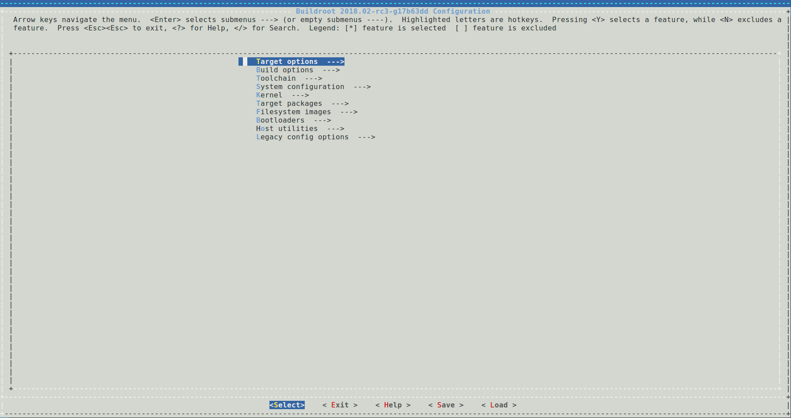

我们可以在配置界面添加或裁剪一些工具，按需求定制系统功能。以添加 `qt53d` 为例：

输入 `/` 进入搜索界面，输入要查找的内容 `qt53d`，按回车进行搜索：

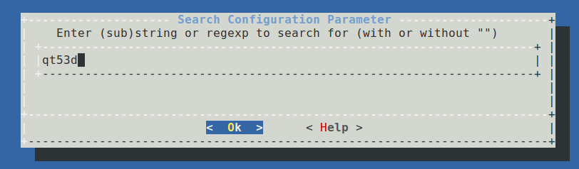

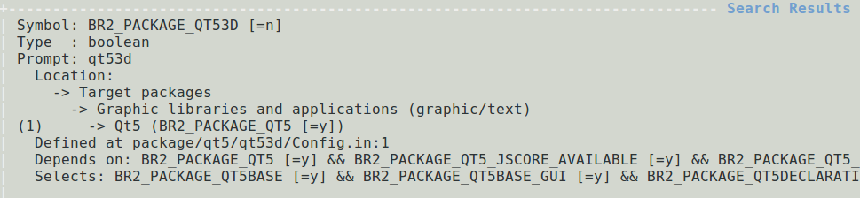

选择 `1` 跳转到对应页面，按空格选中配置：

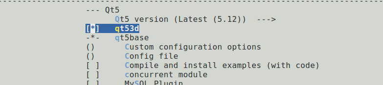

配置完成后，移动到 `Save` 按回车保存到 `.config`；移动到 `Exit` 按回车退出。

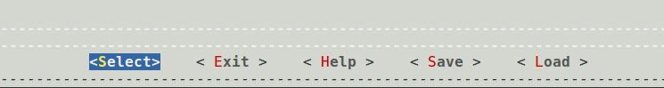

保存配置文件：

```bash
make savedefconfig
```

将修改保存到配置文件 `configs/rockchip_rk3568_defconfig`。

#### Busybox 配置

打开配置界面，进行配置：

```bash
make busybox-menuconfig
```

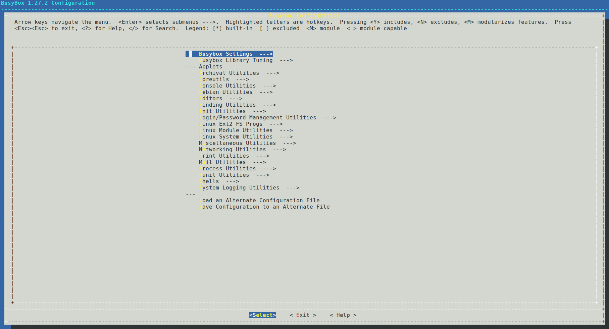

配置完成后，移动到 `Exit` 按回车退出，在弹窗页面选择 `Yes` 保存到 `.config`。


保存配置文件：

```bash
make busybox-update-config
```

将修改保存到配置文件 `board/rockchip/common/base/busybox.config`。

### 编译

配置好 Buildroot 后，直接运行 `make` 进行编译。

#### 编译说明

运行 `make` 进行编译时，会执行以下过程：

1. 下载源码；
2. 配置、编译、安装交叉编译工具链；
3. 配置、编译、安装选择的软件包；
4. 按选择的格式生成根文件系统；

关于 `make` 的更多用法，可通过 `make help` 获得。

#### 编译软件包

我们可以执行 `make <package>` 单独编译某个软件包。软件包的编译主要包括下载，解压，打补丁，配置，编译，安装等过程，具体可以查看 `package/pkg-generic.mk`。

* 下载

  Buildroot 会根据配置 `package/<package>/<package>.mk`，自动从网络获取对应的软件包，包括一些第三方库，插件，实用工具等，放在 `dl/` 目录。

* 解压

  软件包会解压在 `output/rockchip_rk3568/build/<package>-<version>` 目录下。

* 打补丁

  补丁集中放在 `package/<packgae>/` 目录，Buildroot 会在解压软件包后为其打上相应的补丁。如果要修改源码，可以通过打补丁的方式进行修改。

* 配置
* 编译
* 安装

  编译完成后，会将需要的编译生成文件拷贝到 `output/rockchip_rk3568/target/` 目录。

对于某个软件包，我们可以通过 `make <package>-<target>` 调用软件包构建中的某一步骤，如下：

```bash
Package-specific:
  <pkg>                  - Build and install <pkg> and all its dependencies
  <pkg>-source           - Only download the source files for <pkg>
  <pkg>-extract          - Extract <pkg> sources
  <pkg>-patch            - Apply patches to <pkg>
  <pkg>-depends          - Build <pkg>'s dependencies
  <pkg>-configure        - Build <pkg> up to the configure step
  <pkg>-build            - Build <pkg> up to the build step
  <pkg>-graph-depends    - Generate a graph of <pkg>'s dependencies
  <pkg>-dirclean         - Remove <pkg> build directory
  <pkg>-reconfigure      - Restart the build from the configure step
  <pkg>-rebuild          - Restart the build from the build step
```

### 编译输出目录

编译完成后，在编译输出目录 `output/rockchip_rk3568` 会生成子目录，说明如下：

* `build/` 包含所有的源文件，包括 Buildroot 所需主机工具和选择的软件包，这个目录包含所有软件包源码。
* `host/` 主机端编译需要的工具，包括交叉编译工具。
* `images/` 包含压缩好的根文件系统镜像文件。
* `staging/` 这个目录类似根文件系统的目录结构，包含编译生成的所有头文件和库，以及其他开发文件，不过它们没有裁剪，比较庞大，不适用于目标文件系统。
* `target/` 包含完整的根文件系统，对比 `staging/`，它没有开发文件，不包含头文件，二进制文件也经过 `strip` 处理。

### 交叉编译工具

Buildroot 编译完成后，会在 `output/rockchip_rk3568/host/` 目录下，生成交叉编译工具，我们可以用来编译目标程序。

* 交叉编译工具目录

`output/rockchip_rk3568/host/bin/`

* 编译示例 hello.c

```c
#include <stdio.h>
#include <stdlib.h>

int main(int argc, char *argv[])
{
        printf("Hello World!\n");
        return 0;
}
```

* 编译

```bash
.../host/bin/arm-buildroot-linux-gnueabihf-gcc hello.c -o hello
```

* 运行

将可执行程序 `hello` 拷贝到设备，运行 `./hello`，则会看到打印信息 `Hello World!`。

### 重建

对于重建的具体说明，可以查看文档 `buildroot/docs/manual/rebuilding-packages.txt`。

#### 重建软件包

在开发过程中，若修改了某个软件包的源码，Buildroot 是不会重新编译该软件包的。可以按如下方式操作：

* 方式一

```bash
make <package>-rebuild
```

* 方式二

```bash
# 删除软件包的编译输出目录
rm -rf output/rockchip_rk3568/build/<package>-<version>
# 编译
make <package>
```

#### 完全重建

当通过 `make menuconfig`，`make xconfig` 或其他配置工具之一更改系统配置时，Buildroot 不会尝试检测应重建系统的哪些部分。在某些情况下，Buildroot 应该重建整个系统，在某些情况下，仅应重建软件包的特定子集。但是以完全可靠的方式检测到这一点非常困难，因此 Buildroot 开发人员已决定不尝试这样做。

##### 何时需要完全重建

* 更改目标体系结构配置时，需要完全重建；
* 更改工具链配置时，需要完全重建；
* 将其他软件包添加到配置中时，不一定需要完全重建；
* 从配置中删除软件包时，Buildroot 不会执行任何特殊操作。它不会从目标根文件系统或工具链中删除此软件包安装的文件。需要完全重建才能删除这些文件；
* 更改软件包的子选项时，不会自动重建软件包；
* 对根文件系统框架进行更改时，需要完全重建；

一般而言，当你遇到构建错误并且不确定所做的配置更改可能带来的后果时，请进行完全重建。具体说明可以查看文档 `rebuilding-packages.txt`。

##### 如何完全重建

* 方式一

直接删除编译输出目录，之后重新进行配置、编译。

```bash
rm -rf output/
```

* 方式二

执行如下命令，会删除编译输出并重新编译。

```bash
make clean all
```

### 新增本地源码包

开发过程中，Buildroot 自带的软件包有时可能无法满足我们的需求，为此我们需要添加自定义的软件包。Buildroot 支持多种格式的软件包，包括 generic-package、cmake-package、autotools-package 等，我们以 generic-package 举例说明。

* 创建工程目录

```bash
cd path/to/Firefly_Linux_SDK/
mkdir buildroot/package/rockchip/firefly_demo/
```

* 新建 Config.in

在 `firefly_demo/` 下添加 Config.in：

```Kconfig
config BR2_PACKAGE_FIREFLY_DEMO
        bool "Simple Firefly Demo"
```

* 新建 firefly_demo.mk

在 `firefly_demo/` 下添加 firefly_demo.mk：

```makefile
##################################################
###########
#
### firefly_demo
#
##################################################
###########
ifeq ($(BR2_PACKAGE_FIREFLY_DEMO), y)

        FIREFLY_DEMO_VERSION:=1.0.0
        FIREFLY_DEMO_SITE=$(TOPDIR)/../external/firefly_demo/src
        FIREFLY_DEMO_SITE_METHOD=local

define FIREFLY_DEMO_BUILD_CMDS
        $(TARGET_MAKE_ENV) $(MAKE) CC=$(TARGET_CC) CXX=$(TARGET_CXX) -C $(@D)
endef

define FIREFLY_DEMO_CLEAN_CMDS
        $(TARGET_MAKE_ENV) $(MAKE) -C $(@D) clean
endef

define FIREFLY_DEMO_INSTALL_TARGET_CMDS
        $(TARGET_MAKE_ENV) $(MAKE) -C $(@D) install
endef

define FIREFLY_DEMO_UNINSTALL_TARGET_CMDS
        $(TARGET_MAKE_ENV) $(MAKE) -C $(@D) uninstall
endef

$(eval $(generic-package))
endif
```

* 创建源码目录

上文的 Makefile 文件里已经指定了源码目录 `external/firefly_demo/src`。

```bash
cd path/to/Firefly_Linux_SDK/
mkdir external/firefly_demo/src
```

* 编写源码 firefly_demo.c

在 `firefly_demo/src/` 下添加 firefly_demo.c：

```c
#include <stdio.h>
#include <stdlib.h>

int main(int argc, char *argv[])
{
        printf("Hello World!\n");
        return 0;
}
```

* 编写 Makefile

在 `firefly_demo/src/` 下添加 Makefile：

```makefile
DEPS =
OBJ = firefly_demo.o
CFLAGS =
%.o: %.c $(DEPS)
        $(CC) -c -o $@ $< $(CFLAGS)

firefly_demo: $(OBJ)
        $(CXX) -o $@ $^ $(CFLAGS)

.PHONY: clean
clean:
        rm -f *.o *~ firefly_demo

.PHONY: install
install:
        cp -f firefly_demo $(TARGET_DIR)/usr/bin/

.PHONY: uninstall
uninstall:
        rm -f $(TARGET_DIR)/usr/bin/firefly_demo
```

* 修改上一级 Config.in

在 `buildroot/package/rockchip/Config.in` 末尾添加一行：

```Kconfig
source "package/rockchip/firefly_demo/Config.in"
```

* 配置软件包

打开配置菜单 `make menuconfig`，找到 firefly_demo 并选中配置。

* 编译

```bash
# 编译 firefly_demo
make firefly_demo
# 打包进根文件系统
make
# 若修改源码，重新编译软件包
make firefly_demo-rebuild
```

### rootfs-overlay

rootfs-overly 是一个相当不错的功能，它能够在目标文件系统编译完成后将指定文件覆盖到某个目录。通过这种方式，我们可以方便地添加或修改一些文件到根文件系统。

假设我们要在根文件系统的 `/etc/` 目录下添加文件 `overlay-test`，可以按如下步骤操作：

* 设置 rootfs-overlay 根目录

打开配置菜单 `make menuconfig`，通过设置 `BR2_ROOTFS_OVERLAY` 选项，添加用于覆盖的根目录。对于 RK3568，默认已添加了目录 `board/rockchip/rk356x/fs-overlay/`。

* 添加文件到覆盖目录

```bash
cd buildroot/board/rockchip/rk356x/fs-overlay/
mkdir etc/
touch etc/overlay-test
```

* 编译

```bash
make
```

* 下载根文件系统

将编译好的根文件系统 `output/rockchip_rk3568/images/rootfs.ext2` 下载到设备。启动设备，可以看到已添加文件 `/etc/overlay-test`。

也可以通过查看 `target/` 目录，验证是否添加成功：

```bash
ls buildroot/output/rockchip_rk3568/target/etc/overlay-test
```

### Qt 交叉编译环境支持

Firefly 提取了 Buildroot 的交叉编译工具链，支持 EGLFS、LinuxFB、Wayland 等插件，您可以直接使用该工具链开发 Buildroot 上的 Qt 应用程序，而无需下载编译 SDK 代码。

```bash
版本：Qt-5.15.2
主机：x86-64 / Ubuntu 18.04
设备：Firefly RK3568 RK3566  / Buildroot
```

- 下载地址：[Buildroot Qt](https://pan.baidu.com/s/174dQKav2okiAvUWe2OHSPA?pwd=1234)

- 环境部署：详见 Qt5.1x.x_Release.md 文件。

